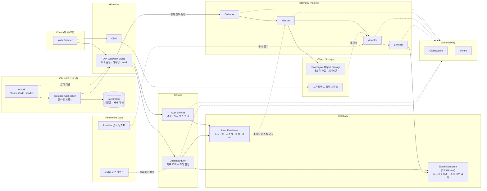

# 시스템 아키텍처 개요

| 항목 | 내용 |
|---|---|
| 대상 범위 | Pulsemetry MVP — 웹 대시보드 + Claude Code · Codex CLI 수집 |
| 상태 | 컴포넌트·연결 구조 확정. 잔여 미확정은 §6 |
| 원본 | `archive/SA.md` (부록 A 노드·엣지 명세는 증류 대상 밖) |
| 이 문서 vs 코드 | 이것은 **목표 구조**다. 구현 현황은 [`repos.md`](repos.md), 레포 간 실제 계약은 [`../contracts/`](../contracts/README.md) |

## 0. 이 문서의 사용 규칙

1. **구조 질문은 이 문서가 먼저다.** 슬랙 대화, 회의 기억, 개인 메모보다 우선한다.
2. **문서와 코드가 다르면 둘 중 하나가 틀린 것이다.** 발견 즉시 고친다. "일단 코드대로 가고 나중에 문서화"는 금지.
3. **정의되지 않은 컴포넌트·연결을 임의로 추가하지 않는다.** §6에 올리고, 이 문서를 먼저 고친 뒤 구현한다.
4. **사실과 추론을 구분한다.** §1~§3은 확정된 구조, §4는 구조에서 도출한 규칙, §6은 아직 정해지지 않은 것이다.

---

## 1. 컴포넌트 지도



9개 논리 영역 / 20개 컴포넌트.

| 영역 | 컴포넌트 | 역할 |
|---|---|---|
| Client (수집) | AI tool, Desktop Application, Local Store | 개발자 로컬 머신. 시그널이 발생하고 1차 가공·전달되는 곳 |
| Client (대시보드) | Web Browser | 관리자가 데이터를 소비하는 곳 |
| Gateway | API Gateway (ALB), CDN | 외부 → 내부의 유일한 진입점과 정적 자산 배포 |
| Service | Auth Service, Dashboard API | 요청-응답형(동기) 서비스 |
| Telemetry Pipeline | Collector, Masker, Adapter, Enricher | 수집 데이터의 단방향 처리 파이프라인 |
| Database | User Database, Signal Database (ClickHouse) | 조회용 정형 데이터 |
| Object Storage | Raw Signal Object Storage, 프론트엔드 정적 저장소 | 마스킹 완료 시그널(재처리용)과 대시보드 빌드 산출물 |
| Reference Data | Provider 공시 단가표, 시나리오 카탈로그 | 전역 참조 데이터. 조직에 종속되지 않는다 |
| Observability | CloudWatch, Sentry | 처리 로그와 트레이싱. **데이터 평면이 아니다** |

### 짚어둘 것

- **Local Store는 서버 구성요소가 아니다.** 사용자 기기의 저장소이며 조직 관리자가 보는 데이터베이스에 포함되지 않는다.
- **인증은 두 자리로 나뉜다.** 요청마다 토큰이 유효한지 보는 것은 각 경로의 애플리케이션 인증 계층이고
  (OTLP 경로는 현행 auth-proxy → backend Spring Security 이관 예정 — [허브 ADR-0001](../adr/0001-otlp-authentication-model.md) · backend ADR-0007),
  계정을 만들고 초대 코드로 설치 인스턴스에 토큰을 발급하는 것은 Auth Service다.
  그래서 Auth Service는 미들웨어가 아니라 Dashboard API와 같은 레이어의 서비스이며, 데스크탑을 상대하는 서버다.
- **토큰이 유효하다는 것과 그 주체가 이 자원에 접근해도 된다는 것은 다르다.** 후자는 각 서비스의 security layer가 판정한다.
  경계는 인증까지만 책임진다.
- **Provider 공시 단가표는 조직 계약이 아니다.** 벤더가 공표한 토큰당 단가이며 조직마다 다르지 않다.
  조직별 계약 단가는 User Database에 있고 조회 시에만 쓰인다.
- **시나리오 카탈로그는 가용성을 담지 않는다.** 가용성은 Dashboard API가 조회 시 판정한다(I-14).
- **Observability에 남는 것은 운영 로그이지 감사 로그가 아니다.** 감사 로그는 저장 대상·저장소가 정해지지 않아 범위 밖이다.
- **인증 종결 지점은 애플리케이션 계층이다.** 경계(ALB)는 TLS 종단과 라우팅만 하고, 별도 auth 서버(외부 IdP)를 두지 않는다
  ([허브 ADR-0001](../adr/0001-otlp-authentication-model.md)이 infra ADR-0008의 ALB 인증안을 대체했다).

### 가공은 두 단계, 비용은 이원화

| 단계 | 하는 일 | 시점 · 주체 |
|---|---|---|
| 1차 가공 | 정규화 · 널 처리 · 분/시간 집계 · Provider별 분류 · **공시 단가 기준 금액** 환산 | 적재 전, Adapter · Enricher |
| 2차 가공 | **조직 계약 단가** 적용 | 조회 시, Dashboard API |

공시 기준 금액은 조직마다 다르지 않으므로 미리 계산해도 안전하고 ClickHouse에서 그대로 집계할 수 있다.
조직이 실제로 부담하는 금액은 계약에 종속되므로 조회 시 계산한다 — **계약이 바뀌어도 재적재가 필요 없다.**
공시 단가 자체가 바뀌면 재처리로 소급 정정한다. 그래서 금액과 함께 **단가 버전**을 저장한다.

파이프라인에서 조직별 데이터를 읽는 것은 **Masker뿐**이다. 집계·비용 전용 저장소는 없다.

---

## 2. 데이터 흐름

### A — 텔레메트리 수집 (쓰기)

```
AI tool → Desktop Application → API Gateway → Collector → Masker → Adapter → Enricher → Signal Database
              └→ Local Store                              └────────────────→ Raw Signal Object Storage
```

- AI tool → Desktop은 **push**다. 벤더의 OTel exporter가 데몬의 loopback 수신기로 보낸다. 로그 파일 감시가 아니다.
- 데몬은 배치를 두 갈래로 나눈다: ① 원본 바이트 → 상위 전달(프라이버시 1차 집행) ② 정규화 결과 → Local Store(개인용).
- 파이프라인은 단방향 4단계다. 정상 흐름에 되돌아오는 경로가 없다.
- **네 단계는 한 애플리케이션 안의 모듈이고 전달은 in-process 호출이다**([`../adr/0005-single-app-telemetry-topology.md`](../adr/0005-single-app-telemetry-topology.md)).
  단계는 배포 경계가 아니라 모듈 경계로 나뉘며, 사이에 네트워크 홉도 큐도 두지 않는다.
- **Masker에서 경로가 갈라진다** — ① 마스킹 완료 시그널 보존(Object Storage) ② 가공 계속(Adapter).
  이 분기가 raw-first 원칙을 구조로 구현한 지점이다. 다만 여기서 "raw"는 마스킹 전 원본이 아니라 **가공 전** 시그널이다.
- Adapter 이후 변환이 실패하면 그 시그널은 Object Storage에만 남는다. 이것이 흐름 D의 복구 원천이며, 별도 DLQ에 의존하지 않는다.
- 프롬프트는 정책에 따라 이 경로를 탄다. Privacy가 꺼져 있으면 데몬이 전송 전에 제거하므로 서버에 도달하지 않는다.
- Masker가 어느 조직의 규칙을 적용할지는 함께 넘어온 인가 정보로 정한다.

실제 구현 경로(auth-proxy → collector → processor)와 그 계약은 [`../contracts/telemetry-ingest.md`](../contracts/telemetry-ingest.md)에 있다.

### B — 대시보드 조회 (읽기)

```
Web Browser → API Gateway → Dashboard API → Signal Database
                                          → User Database
```

사용량 수치(Signal)와 조직 구조(User)를 조인해야 "부서별·팀별 비용"이 나온다.
조직이 부담하는 금액은 이 시점에 계산된다 — Signal DB의 토큰 집계 × User DB의 조직 계약 단가.
Signal DB에 이미 있는 공시 기준 금액은 계약 미입력 조직의 기본값이자 계약 대비 기준선 비교용이다. **두 값은 화면에서 섞이지 않는다.**

### C — 인증

```
검증   Client → API Gateway(TLS 종단) → 앱 인증 계층
발급   Client → API Gateway → Auth Service → User Database
```

- **검증은 앱 인증 계층이 한다.** 경계는 TLS 종단과 라우팅까지만 책임진다(허브 ADR-0001).
- **발급은 Auth Service가 한다.** 외부 IdP는 발급에도 검증에도 관여하지 않는다.
- 설치 인스턴스 인증: 초대 코드 → `installation_token`(`pit_`)과 `telemetry_token`(`ptt_`) 발급 → 둘 다 OS 키링.
  자세한 계약은 [`../contracts/enrollment-api.md`](../contracts/enrollment-api.md).
- 주체가 다르다 — 웹은 **사람(관리자) 계정**, 데스크탑은 **설치 인스턴스(installation)**다.
- **인증에 쓰인 토큰은 파이프라인으로 흘러가지 않는다.** 검증으로 얻은 인가 정보(`org_id` · `installation_id` · `user_id`)만 하위로 전달된다(I-11).

### D — 재처리 (복구)

```
Raw Signal Object Storage → Adapter → Enricher → Signal Database
```

정상 흐름이 아니라 **운영 개입 경로**다. 트리거는 둘뿐이다.

| # | 트리거 | 하는 일 |
|---|---|---|
| 1 | AI Provider의 OTel 규약 변경 | Adapter 변환 규칙을 패치한 뒤 이미 흘러간 데이터를 새 규칙으로 다시 변환해 소급 정정 |
| 2 | 변환 실패로 미적재 | Object Storage에서 꺼내 Adapter 로직부터 다시 태움 |

시작점은 **항상 Adapter**다. Object Storage의 데이터는 이미 마스킹을 마쳤으므로 Masker를 다시 태우지 않는다(I-9).
대상 선택은 raw 오브젝트 메타데이터(배치 ID · 수신 시각 · `org_id`/`installation_id`/`user_id` · provider · 마스킹 정책 버전 · 스키마 버전)로 한다.
실행 주체는 내부 운영 도구다(I-8). 재처리는 멱등해야 한다(I-10).

### E — 시나리오 적용

```
Web Browser → API Gateway → Dashboard API → 시나리오 카탈로그 (정의)
                                          → User Database (정책 · 조직 상태 → 가용성 판정)
```

카탈로그는 정의만 준다(질문 · 필요 지표 · 대상 화면과 필터 · 측정 한계 단서 · 선행 조건).
가용성은 조회 시 판정하므로 같은 시나리오가 조직마다 다르게 보인다(I-14).
**이 흐름은 Signal Database를 읽지 않는다** — 시나리오는 새 지표를 만들지 않는다(I-13).

### F — 정책 Manifest 배포

```
쓰기   Web Browser → API Gateway → Dashboard API → User Database
읽기   Desktop Application → API Gateway → Auth Service → User Database
       Masker → User Database
```

정책의 소유자는 User Database 하나다. 두 집행 지점이 같은 원본을 보므로 규칙이 갈라지지 않는다.
다만 **반영 시점이 다르다** — 서버는 즉시, 데스크탑은 Manifest를 다시 받은 뒤다.
현재 재조회 경로가 없다는 것이 [`../product/prd.md`](../product/prd.md) §8-1의 열린 이슈다.

### 폴백 — AI tool → API Gateway 직결

발동 조건은 셋뿐이다: ① 클라이언트가 로컬 수신기 토큰을 확보하지 못함 ② 조직 manifest의 프로토콜을 데몬이 전달할 수 없음
③ 사용자가 로컬 파이프라인을 명시적으로 해제. 두 경로는 **설치 단위 택일**이라 중복 수집이 발생하지 않는다.
벤더 OTel exporter가 시그널당 endpoint를 하나만 받기 때문에 구조적으로 이중 전송이 불가능하다.

---

## 3. 저장소 3종의 역할 분리

| 저장소 | 담는 것 | 쓰는 주체 | 읽는 주체 |
|---|---|---|---|
| **User Database** | 조직 · 팀 · 사용자 · 권한 · 정책 · 조직별 계약 단가 | Auth Service(계정·토큰), Dashboard API(조직 설정) | Auth Service, Dashboard API, Masker(정책) |
| **Raw Signal Object Storage** | 마스킹 완료 시그널 + 재처리용 메타데이터 | Masker | 재처리 배치 (트리거 2종) |
| **Signal Database (ClickHouse)** | 정규화·보강된 조회용 시그널 + 시간 단위 집계 + 공시 기준 금액 | Enricher | Dashboard API |

- Raw Signal Object Storage의 읽기 목적은 **재처리 둘뿐**이다. 어느 쪽도 사람이 원본을 열람하는 경로가 아니다.
  대시보드에 원본 조회 화면·API가 없는 이유다.
- **Signal Database에 쓰는 주체는 Enricher 하나뿐**이다. 다른 컴포넌트가 직접 쓰기 시작하면 데이터 일관성이 즉시 깨진다.
- User Database에 쓰는 주체는 둘이고 다루는 영역이 겹치지 않는다. 파이프라인에서 이 저장소를 보는 것은 **Masker뿐**이다.
- 어떤 저장소에도 자격증명 원문을 쓰지 않는다(I-11).

공유 도메인 모델(tenant / team / member)의 정의는 [`../contracts/data-model.md`](../contracts/data-model.md)에 있다.

---

## 4. 아키텍처 불변식

컴포넌트 연결 구조가 함의하는 규칙이다. 이견이 있으면 §6에 올리고 이 문서를 고친 뒤 구현한다.

| # | 규칙 | 어겼을 때 |
|---|---|---|
| I-1 | 외부 트래픽은 API Gateway(단일 진입점)를 통과한다. 클라이언트가 Collector·Dashboard API를 직접 호출하는 경로는 없다 | 인증 우회, 테넌트 위조 |
| I-2 | Masker를 거치지 않은 데이터는 어떤 서버 저장소에도 쓰지 않는다 | 마스킹 전 PII 영속화 (되돌릴 수 없음) |
| I-3 | 파이프라인 4단계를 건너뛰지 않는다 | 스키마 미변환 데이터가 Signal DB에 유입 |
| I-4 | Signal Database 쓰기는 Enricher만 수행한다 | 보강 안 된 레코드 혼입, 집계 신뢰도 붕괴 |
| I-5 | Dashboard API는 지표를 읽고 조직 설정을 쓴다. 파이프라인과 Signal Database에는 쓰지 않는다 | 읽기 경로와 수집 경로의 책임 분리 붕괴 |
| I-6 | User Database 쓰기 주체는 둘뿐 — 계정·토큰은 Auth Service, 조직 설정은 Dashboard API | 권한 데이터 정합성 붕괴 |
| I-7 | 클라이언트 마스킹을 신뢰해 서버 Masker를 생략하지 않는다 | 사용자 기기 코드가 유일한 방어선이 됨 |
| I-8 | Raw Signal Object Storage에 사용자 조회 경로를 열지 않는다. 재처리는 내부 운영 도구로만 트리거한다 | 재처리용 저장소가 원본 열람 창구가 됨 |
| I-9 | 재처리는 Adapter부터 시작한다. 이미 마스킹된 데이터를 Masker에 다시 태우지 않는다 | 데이터 이중 훼손 |
| I-10 | 재처리는 멱등해야 한다 | 복구할수록 비용·사용량이 부풀어 지표를 못 믿게 됨 |
| I-11 | 자격증명(토큰 원문·해시)은 어떤 서버 저장소에도 쓰지 않는다. 테넌트 귀속은 검증으로 얻은 인가 정보로 한다 | 오브젝트 스토리지 유출이 곧 자격증명 유출 |
| I-12 | 파이프라인 각 단계는 작업 전후 상태를 로깅한다 | 실패한 시그널을 특정할 수 없어 흐름 D의 복구 대상을 고를 수 없음 |
| I-13 | 시나리오는 새 지표를 만들지 않는다. 카탈로그가 참조하는 지표는 지표 레지스트리에 정의돼 Signal DB에 이미 존재하는 것뿐이다 | 수집 근거가 없는 지표가 화면에만 생김 |
| I-14 | 시나리오 가용성은 저장하지 않고 조회 시 판정한다 | 정책을 바꿔도 가용성이 따라오지 않음 |

- I-2의 "서버 저장소"는 문자 그대로다. 클라이언트 Local Store에 남는 개인 데이터는 이 불변식의 대상이 아니다.
- I-9 · I-10 · I-12는 맞물린다. 로깅이 복구 대상을 특정하게 하고, 재처리 시작점이 마스킹 재적용을 막고,
  멱등성이 복구가 지표를 망치지 않게 한다. 셋 중 하나가 빠지면 흐름 D가 안전한 운영 절차가 되지 못한다.
- **I-11은 토큰 해시 저장 방식과 충돌하지 않는다.** 파이프라인·오브젝트 스토리지에 자격증명을 남기지 않는다는 뜻이며,
  enrollment DB가 검증 목적으로 해시를 보관하는 것은 그 경계 밖이다 — [`../contracts/enrollment-api.md`](../contracts/enrollment-api.md) §4.

---

## 5. 목표 구조 대비 현재 구현 (요약)

이 문서는 목표 구조다. 2026-08 기준 구현은 다음 지점에서 다르다. 레포별 상세는 [`repos.md`](repos.md).

| 목표 컴포넌트 | 현재 |
|---|---|
| Masker (조직별 규칙 2차 마스킹) | collector의 `redaction`(전역 고정 패턴)으로만 부분 구현. 조직별 규칙 참조 없음 |
| Raw Signal Object Storage | 파일 아카이브로 대체. **write-only** — 재처리 리더가 없다 |
| Adapter의 공시 단가 환산 | placeholder 단가표 |
| Auth Service | `pulsemetry-backend`의 enrollment-api가 설치 토큰 발급까지 담당. 사람 계정·로그인은 미구현 |
| Dashboard API | 미착수. frontend 레포도 없다 |
| ~~Identity Provider~~ (목표 구조에서 제거 — 허브 ADR-0001) | 인증은 앱 계층: 현행 auth-proxy(OTLP), backend Spring Security로 이관 예정. Cognito 구축 코드는 의도적 잔존(제거 예정) |

**I-2 · I-8 · 흐름 D는 아직 구조적으로 미충족**이다. MVP 진행 단계로 보면 자연스럽지만, 미충족 상태임을 문서가 감추지 않는다.

---

## 6. 미확정 (TBD)

| # | 질문 | 막히는 작업 | 상태 |
|---|---|---|---|
| Q5 | Adapter의 변환 대상 스키마와 Enricher 보강 항목의 세부 필드 | 파이프라인 전체 | 부분 확정 — 구조는 *공통 스키마 + provider별 확장*으로 확정. 필드 미정 |
| Q8 | 수집 트래픽과 대시보드 트래픽의 부하 분리 | Gateway 구성 | 부분 확정 — 같은 Gateway를 공유하고 경로로 분기. 뒷단 분리는 미정 |
| Q10 | Self-hosted 배포 시 구성 차이 + 관측성 대체 경로 | 배포 아키텍처 | 미정 |
| Q11 | 각 컴포넌트의 기술 스택·런타임 | 전체 | 부분 확정 — Signal DB = ClickHouse, User DB = PostgreSQL, 경계 = ALB, 관측성 = CloudWatch · Sentry |
| Q14 | Provider 공시 단가표의 소유·갱신 주체와 저장 위치 | Adapter의 금액 환산 | 미정 |
| Q15 | 실패 시그널 식별 방식 — 실패 마커·배치 키·재처리 대상 선택 기준 | 흐름 D 복구 | 미정 |
| Q16 | LLM 자유 질의 확장 시 생성 시나리오의 저장 위치 | 시나리오 엔진 확장 | 미정 |
| Q17 | LLM 생성 출력의 검증 방식 | 시나리오 엔진 확장 | 미정 |

§6의 항목이 확정되면 해당 행을 지우고 본문(§1~§4)에 사실로 편입한다.
컴포넌트·연결이 추가·삭제되면 §1 다이어그램과 표를 함께 고친다.
