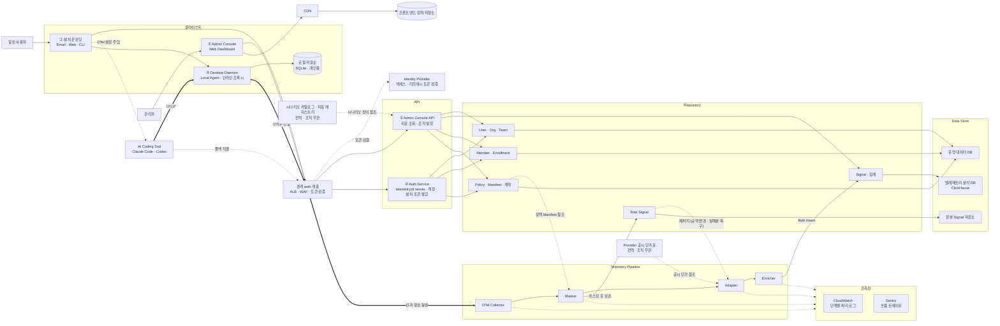
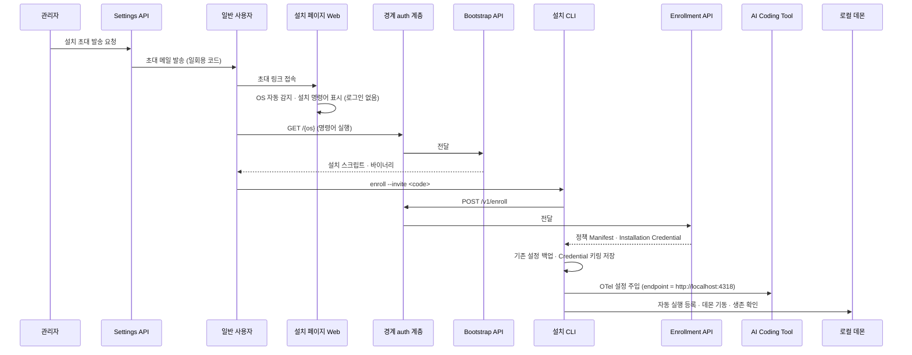
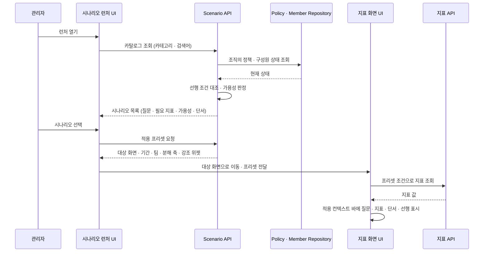

# Pulsemetry — Application Architecture (AA)

화면 · API · 저장소 구현은 이 문서를 기준으로 한다. 구조가 바뀌면 코드보다 이 문서를 먼저 고친다.

---

## 0. 문서 정보

| 항목 | 내용 |
| --- | --- |
| 대상 시스템 | Pulsemetry — 사내 AI 사용 통합·가시화 플랫폼 |
| 적용 범위 | Admin Console · 설치 온보딩 · Desktop Daemon · Telemetry Pipeline · 관측성 · 데이터 계층 |
| 상태 | MVP 개발 기준. 잔여 미정 항목은 §11 |

---

## 1. 이 문서를 쓰는 법

1. 구현 착수 전 — 담당 컴포넌트 섹션(§6)에서 책임 범위와 호출 경로를 확인한다.
2. API를 새로 만들 때 — §6의 해당 API 그룹 표에 행을 추가하고 §8 매핑표를 함께 갱신한다.
3. 레이어 규칙(§5)을 위반하는 구현은 하지 않는다. 특히 UI가 Repository나 DB에 직접 접근하지 않는다.
4. 점선 · 회색으로 표기된 항목은 MVP 범위 밖이거나 미구현이다. §9에서 상태를 확인한 뒤 착수한다.
5. 합의되지 않은 구조는 임의로 만들지 않는다. 필요하면 §11 열린 이슈로 올린다.

---

## 2. 시스템 한눈에 보기

Pulsemetry는 3개의 사용자 접점과 1개의 텔레메트리 수집 파이프라인, 그리고 그 아래 공통 데이터 계층으로
구성된다.

| # | 접점 | 사용자 | 역할 |
| --- | --- | --- | --- |
| ① | Admin Console (Web Dashboard) | 관리자 | 조직의 AI 사용·비용 지표를 조회하고, 조직 구성·계약·수집 정책을 설정 |
| ② | 설치 온보딩 (Email · Web · CLI) | 일반 사용자(개발자) | 초대를 받아 도구에 텔레메트리 설정을 주입 |
| ③ | Desktop Daemon (Local Agent) | 일반 사용자(백그라운드) | 로컬 수집·전달 에이전트 + 정책 Manifest·Credential 보관 |

Signal은 로컬 데몬을 거친다. AI Coding Tool(Claude Code · Codex)의 OTel exporter는 데몬의 loopback
수신기(`http://localhost:4318`)를 향하고, 데몬이 로컬에 집계·저장한 뒤 회사 Collector로 전달한다.
수신과 전달을 한 프로세스에서 하는 인라인 프록시다.

도구가 회사 Collector로 직결되는 경우는 폴백 3종뿐이다 — ① 키링 ingest 토큰 확보 실패,
② manifest `otlp.protocol = grpc`, ③ 사용자가 `telemetryctl local disable` 실행. 두 경로는 병행이
아니라 설치 단위 택일이므로 중복 수집이 발생하지 않는다.

따라서 데몬은 제어 평면(설정·정책·자격증명)과 데이터 평면(Signal)을 겸한다. 다만 데몬이 죽으면
배선된 상태에서 텔레메트리가 유실되므로, 설치 시 로그인 자동 실행을 함께 등록한다(§6.3 · §6.5).



로컬 저장소(SQLite)는 개인 대시보드와 배치 전달을 위한 클라이언트 내부 저장소이며, 조직 관리자가
보는 서버 데이터베이스에는 포함되지 않는다(§6.9).

관측성과 두 전역 참조 데이터는 데이터 평면 밖이다. 관측성은 각 단계가 자기 처리 상태를 내보내는
경로이고(§6.11), Provider 공시 단가표는 Adapter가 금액 환산에 참조하는 전역 데이터다 — 조직별 계약
단가(R6)와 다른 것이다(§6.7). 시나리오 카탈로그와 지표 레지스트리는 Admin Console API가 시나리오
목록과 적용 프리셋을 구성할 때 읽는다(§6.2 · §6.9).

`Raw Signal ┈┈▶ Adapter` 는 정상 흐름이 아니다. 규약 변경 소급 재변환과 실패분 복구를 위한 운영 개입
경로이며 내부 운영 도구로만 트리거한다(§7-5).

인증은 경계에서 끝난다. 경계 auth 계층이 Identity Provider에 위임해 토큰을 검증하고, 통과한 요청만
각 API로 넘긴다. 요청이 거쳐 가는 인증 서비스는 없다 — Auth Service는 앞단 미들웨어가 아니라 계정과
설치 토큰을 발급하는 API다(§6.4 · §6.10).

Admin Console은 두 경로를 쓴다. 화면 자체는 CDN이 프론트엔드 정적 저장소에서 내려주고, 데이터 요청만
경계 auth 계층으로 간다.

---

## 3. 범례 · 표기 규칙

| 표기 | 의미 |
| --- | --- |
| 🔵 파랑 | UI / 클라이언트 |
| 🟢 초록 | API |
| ⚪ 회색 | Repository |
| 🔴 빨강 | 텔레메트리 파이프라인 |
| 🟣 보라 | 외부 시스템 |
| 🛢 원통 | 데이터 스토어 |
| 🟡 노랑 점선 | MVP 범위 · 미구현 — 만들기로 했으나 아직 없음 |
| ⬜ 회색 점선 | 향후 계획 (MVP 밖) — 이번 범위 아님 |
| ── 실선 | 호출 · 데이터 흐름 |
| ┈┈ 점선 | 설정 참조 · 간접 호출 |

---

## 4. 액터

사람 액터는 2역할이다 — 팀장(Manager) 역할은 두지 않는다. 팀은 데이터 모델로 존재하지만(§6.1 조직
구성) 팀장이라는 별도 권한 주체는 MVP에 없다.

| 액터 | 설명 | 진입 지점 |
| --- | --- | --- |
| 관리자 | 조직 · 팀 · 구성원 · 계약 · 정책 운영 + 지표 조회 | ① Admin Console (대시보드 사용) |
| 일반 사용자 | 도구를 설치·사용하는 개발자 | ② 설치 온보딩 (설치 진행) |
| AI Coding Tool | Claude Code · Codex. 자체 OTel 기능으로 Signal 발생 | 로컬 데몬의 loopback 수신기 (폴백 시 회사 Collector 직결) |

---

## 5. 레이어 구조와 아키텍처 원칙

연결 구조에서 도출한 구현 규칙이다. 위반하는 코드는 리뷰에서 반려한다.

1. **호출 방향은 단방향이다.** `UI → API → Repository → Data Store`
   UI는 Repository나 DB에 직접 접근하지 않는다. API가 다른 API를 호출하지도 않는다 — 기능이 겹치면
   같은 API 그룹 안의 하위 기능으로 둔다(초대 발급이 Settings API의 하위 기능인 이유, §6.2).
2. **UI 그룹과 API 그룹은 1:1로 대응한다.** (Overview UI ↔ Overview API, Policies UI ↔ Policy API …)
   화면을 추가하면 대응 API 그룹을 함께 정의한다.
3. **데이터 접근은 Repository를 거친다.** API가 DB에 직접 쿼리하지 않는다.
4. **평면은 나뉘지만 데몬은 둘을 겸한다.**
   - 제어 평면: 설치 CLI · Daemon · Policy/Manifest · Credential
   - 데이터 평면: AI Coding Tool → Desktop Daemon → 경계 auth 계층 → OTel Collector → Masker → Adapter → Enricher → Signal Repository
   - 데몬은 Signal 전송 경로다. 도구 직결은 폴백이며 설치 단위로 택일된다(§2).
5. **원본 보존은 마스킹 이후다.** Masker가 마스킹을 마친 Signal을 Raw Signal Repository에 보관한다.
   Raw 저장소는 재처리용이며 조회 기능을 제공하지 않는다. 마스킹 전 PII는 어떤 서버 저장소에도 쓰지
   않는다. 재처리 트리거는 둘뿐이다 — ① AI Provider의 OTel 규약 변경에 따른 소급 재변환, ② 변환
   실패로 분석 DB에 적재되지 못한 데이터의 복구. 어느 쪽이든 Adapter부터 다시 태우고 Masker는
   재실행하지 않으며(이미 마스킹된 데이터다), 멱등해야 한다. 실행 주체는 내부 운영 도구이지 관리자
   화면이 아니다(§6.7 · §7-5).
6. **정책은 코드가 아니라 Manifest로 배포한다.** Policy · Manifest Repository가 단일 기준이고, 설치 CLI ·
   Daemon · Masker가 이를 참조한다.
7. **저장소는 성격별로 분리한다.** 운영 데이터(OLTP) / 텔레메트리 분석(OLAP) / 원본 오브젝트 스토리지.
   집계·비용을 담는 별도 저장소를 두지 않는다 — 집계는 분석 DB 안에 있고, 계약별 단가 환산은 조회 시
   API가 수행한다(§6.7 · §6.8).
8. **외부 트래픽은 경계 auth 계층을 통과한다.** 대시보드 · 데몬 · 폴백 직결 도구 · 설치 CLI 모두
   예외가 없다. 이 계층이 Identity Provider에 위임해 토큰을 검증하고, 검증으로 얻은 인가 정보를
   실어 내부로 넘긴다. 그 인가 정보로 무엇에 접근할 수 있는지는 각 API의 security layer가 판정한다 —
   경계는 인증까지만 책임진다.
9. **마스킹은 두 지점에서 집행한다.** 클라이언트 데몬이 1차(전송 전 제거), 서버 Masker가 2차다.
   클라이언트는 사용자 기계에서 도는 코드라 완전히 신뢰할 수 없으므로 서버 방어선을 유지한다.
10. **자격증명은 어떤 서버 저장소에도 영속화하지 않는다.** 데몬이 헤더에 붙여 보낸 인증 토큰은 경계
    계층에서 검증하고 버린다. Raw 저장소에는 검증으로 얻은 인가 정보
    (`org_id` · `installation_id` · `user_id`)만 남긴다 — 토큰 원문도, 해시도 쓰지 않는다.
    오브젝트 스토리지 유출이 곧 자격증명 유출이 되는 상황을 만들지 않기 위해서다.
11. **파이프라인 각 단계는 작업 전후 상태를 로깅한다.** Collector · Masker · Adapter · Enricher 모두
    예외가 없다(§6.11). 로그가 없는 단계는 실패한 Signal을 특정할 수 없어 원칙 5의 복구가 성립하지 않는다.
12. **비용은 두 값으로 나뉜다.** Adapter가 Provider 공시 단가로 계산한 기준 금액은 적재 시 저장하고,
    조직 계약 단가를 적용한 실제 금액은 조회 시 계산한다(§6.7). 파이프라인은 조직별 데이터를 읽지
    않는다 — 공시 단가표는 전역 참조 데이터다.

---

## 6. 컴포넌트 상세

### 6.1 ① Admin Console (Web Dashboard) — UI

Admin Console은 성격이 다른 두 영역으로 나뉜다. 화면을 추가할 때 어느 쪽인지 먼저 정한다.

- **대시보드 = 지표를 본다.** 조직 전체 · 팀 · 구성원 개인 단위로 나뉘고, 그 밖에 모델 · 예산 · 스킬
  같은 분류가 더 붙을 수 있다(예산 · 스킬 계열은 향후). 여기서는 아무것도 설정하지 않는다.
- **조직 설정 = 관리자가 서비스를 커스터마이징한다.** 조직-팀-사원 매핑, AI Provider 계약 입력,
  조직 전체에 통용되는 수집·마스킹 정책이 여기 들어간다.

**대시보드 (지표)**

| 화면 그룹 | 구성 요소 | 상태 |
| --- | --- | --- |
| Overview UI | KPI 요약 카드 · 기간 · 팀 필터 · 도구별 사용 요약 | MVP |
| Activity UI | 작업 분포(코드 · 테스트 · 리뷰) · 세션 · 이벤트 타임라인 · Signal 상세 | MVP |
| Cost & Models UI | 모델별 비용 · 토큰 · 팀 · 구성원별 비용 · 기간 비교 추이 | MVP |
| Members UI | 구성원별 사용량 · 비용 (지표 전용) | MVP |
| 시나리오 런처 UI | 카테고리 목록 · 시나리오 검색 · 가용성 배지 · 적용 컨텍스트 바 | MVP |
| 향후 확장 화면 | Teams(팀 비교) · Projects · Insights(스킬) · Alerts · Budgets · Integrations | MVP 밖 |

시나리오 런처는 특정 화면에 속하지 않고 대시보드 전역에 걸리는 표면이다. 관리자가 답을 얻고 싶은
질문을 고르면 대상 화면으로 이동시키고, 기간 · 팀 · 분해 축 · 강조 위젯으로 이루어진 프리셋을
넘긴다. 지표 화면 4종은 이 프리셋을 입력으로 받는다.

시나리오는 새 지표를 만들지 않는다. 이미 수집·집계된 지표를 질문 단위로 묶어 보여줄 뿐이며 지표를
해석하거나 조언하지 않는다. 향후 확장 화면의 Insights와 성격이 다르다.

**조직 설정 (관리)**

| 화면 그룹 | 구성 요소 | 상태 |
| --- | --- | --- |
| 인증 · 온보딩 UI | 로그인 / SSO · 회원가입 · 조직 생성 · 초대 수락 · 최초 설정 | MVP |
| Organization UI | 조직 정보 · 조직 구성(팀 · 사원 매핑) · AI Provider 계약 · 구성원 계정 · 역할 · 설치 상태 | MVP |
| Policies UI | 정책 요약 · OTLP · Signals 설정 · Privacy · 마스킹 규칙 · Repository Allowlist · Resource Attributes | MVP |
| Settings UI | 서비스 설정 · 설치 초대 발송 · 초대 코드 상태 · 재발급 | MVP |

Members가 두 곳에 나오는 것은 의도된 분리다. 대시보드 `Members`는 구성원별 사용량·비용을 보는 지표
화면이고, Organization의 구성원 관리는 계정·초대·설치 상태를 다루는 운영 화면이다. 참조하는 저장소도
다르다(전자는 Signal, 후자는 Member · Enrollment).

AI Provider 계약은 조직이 각 Provider와 맺은 토큰당 단가 계약을 입력하는 화면이다. Cost & Models
지표의 2차 가공(조직 계약 단가 적용)이 이 값을 읽는다(§6.7). 계약을 입력하지 않은 조직에는 적재 시
저장된 공시 단가 기준 금액이 그대로 보인다 — 두 값은 이름을 구분해 표시한다.

설치 초대 발송은 Settings에만 있다. 조직 구성원 관리 화면에서는 초대 상태를 볼 뿐 발송하지 않는다.

### 6.2 ① Admin Console API

모든 API 그룹은 경계 auth 계층을 통과한 뒤 호출되며, 넘어온 인가 정보로 접근 가능 여부를 자체
security layer에서 판정한다(§5 원칙 8).

| API 그룹 | 책임 | 참조 Repository |
| --- | --- | --- |
| 인증 · 온보딩 API | 회원가입 · 조직 생성 · 초대 수락 처리 · 관리자 계정 관리 | User · Org · Team |
| Overview API | KPI 집계 조회 · 기간 · 팀 필터 쿼리 · 도구별 사용 요약 조회 | Signal · 집계 |
| Activity API | 작업 분포 집계 조회 · 세션 · 이벤트 타임라인 조회 · Signal 상세 조회 | Signal · 집계 |
| Cost & Model API | 모델별 · 팀 · 구성원별 비용 조회 · 기간 비교 추이 · 조직 계약 단가 적용(2차 가공). 공시 단가 기준 금액은 Signal Repository에 저장된 값을 읽는다 | Signal · 집계 + Policy · Manifest · 계약 |
| Members API (지표) | 구성원별 사용량 · 비용 조회 | Signal · 집계 |
| Scenario API | 시나리오 카탈로그 조회 · 검색 · 조직 상태 기준 가용성 판정 · 적용 프리셋 반환 | Policy · Manifest · 계약 + Member · Enrollment |
| Organization API | 조직 정보 조회 · 수정 · 조직 구성(팀 · 사원 매핑) · AI Provider 계약 등록 · 수정 · 구성원 목록 · 역할 변경 · 설치 상태 조회 | User · Org · Team / Member · Enrollment / Policy · Manifest · 계약 |
| Policy API | 정책 조회 · 수정 · 검증 · OTLP / Signals 설정 · 마스킹 · Privacy 규칙 · Repository Allowlist · Manifest 생성 · 발행 · 이력 | Policy · Manifest · 계약 |
| Settings API | 서비스 설정 변경 · 설치 초대 발급 · 발송 · 초대 코드 상태 조회 · 재발급 | Member · Enrollment |

초대 발급은 Settings API의 하위 기능이다. 별도 API 그룹이 아니며, Settings API가 다른 API를 호출하지도
않는다(§5 원칙 1). "초대 발급 API"라는 이름은 §6.4에서 설치 온보딩 계열의 서버 엔드포인트를 가리킬
때만 쓴다.

**Scenario API가 반환하는 것**

Scenario API는 지표를 조회하지 않는다. 어느 화면에 어떤 필터와 분해 축을 적용하고 어느 위젯을
강조할지만 반환하며, 실제 지표 조회는 UI가 그 프리셋으로 Overview · Activity · Cost & Model ·
Members API를 호출해 수행한다. Scenario API가 지표를 대신 읽으면 조회 책임이 두 곳에 생기고,
시나리오가 늘 때마다 조회 경로가 함께 늘어난다.

시나리오 하나는 질문 · 필요 지표 · 대상 화면과 프리셋 · 답을 얻은 뒤의 조치 · 측정 한계 단서 ·
가용성 판정에 필요한 선행 조건으로 이루어진다. 이 정의의 집합이 시나리오 카탈로그이며, 카탈로그가
참조할 수 있는 지표 ID의 목록이 지표 레지스트리다. 둘 다 조직에 종속되지 않는 전역 참조
데이터다(§6.9).

**가용성은 저장하지 않고 조회 시 판정한다**

같은 시나리오라도 조직의 수집 정책 설정과 관리자 입력 상태에 따라 답할 수 있는지가 달라진다.
Scenario API는 카탈로그의 선행 조건을 Policy · Manifest · 계약 및 Member · Enrollment Repository의
현재 상태와 대조해 세 값 중 하나를 매긴다.

| 가용성 | 의미 | 판정 근거 |
| --- | --- | --- |
| 지금 확인 가능 | 조직의 현재 수집 데이터로 답이 나온다 | 선행 조건을 모두 충족 |
| 설정 필요 | 관리자 조치가 선행돼야 한다 | 미충족 선행 조건이 있음. 해당 설정 화면을 함께 반환한다 |
| 곧 지원 | 데이터는 오지만 화면이 아직 없다 | 카탈로그의 제품 상태 값. 조직과 무관하다 |

앞의 두 값은 조직마다 다르므로 저장하지 않는다. 저장하면 정책을 바꿀 때마다 재계산이 필요해지고,
그 사이에 답할 수 없는 시나리오가 답할 수 있는 것처럼 보인다.

원본 조회 API는 없다. Raw Signal Repository는 재처리 전용이며 조회 경로를 두지 않는다(§5 원칙 5).

### 6.3 ② 설치 온보딩 (Email · Web · CLI)

| 단계 | 구성 요소 | 상태 |
| --- | --- | --- |
| 설치 초대 이메일 | 초대 링크(일회용 코드) · 설치 가이드 안내 · 재발급 · 문제 해결 안내 | MVP |
| 설치 페이지 (Web) | OS 자동 감지 · OS별 설치 명령어 표시 · 명령어 복사 · 실행 안내. 웹 로그인 없음 | MVP |
| 설치 CLI (`telemetryctl`) | 도구 설정 탐지(Claude · Codex) · 기존 설정 백업 · manifest 기준 OTel 설정 주입 · 로컬 수신기로 배선 | MVP |
| 설치 CLI | Credential 보안 저장 — OS 키링 3계정(`installation` · `local-ingest` · `telemetry`) | ✅ 구현 완료 |
| 설치 CLI | 데몬 자동 실행 등록 · 기동 — macOS LaunchAgent · Linux systemd user unit | ✅ 구현 완료 (Windows 미구현) |
| 지원 OS | Windows · macOS · Linux 3종. WSL은 별도 환경으로 취급 | MVP |
| 설치 CLI | 기존 OTel endpoint 충돌 감지 · 충돌 시 중단 | 🟡 미구현 (현재 덮어씀) |

**흐름:** 설치 초대 이메일 →(초대 링크 접속)→ 설치 페이지(Web, OS 감지) →(명령어 복사·실행)→
부트스트랩 스크립트가 바이너리 설치 →(`enroll --invite <code>`)→ 설치 CLI → 설정 주입 · 로컬 배선 ·
자동 실행 등록 · 데몬 기동

웹 페이지는 안내 표면일 뿐이다. 로그인하지 않으며, 사용자를 식별하는 것은 초대 코드다. 일반 사용자가
이 서비스의 웹에 로그인하는 경로는 MVP에 없다.

자동 실행은 사용자 수준 서비스다 — 로그인 시 시작하고 로그아웃하면 함께 종료한다. 시스템 수준
서비스는 로그인 전 root로 돌아 키링을 읽지 못해 데몬이 아예 뜨지 못한다.

### 6.4 ② Auth Service (`telemetryctl server`)

데스크탑을 상대하는 서버다. 설치 온보딩과 설치 인스턴스 토큰 발급을 함께 맡는다 — 초대 코드를
검증해 Credential을 내주는 일과 그 Credential을 갱신해 주는 일이 같은 자리에 있어야 하기 때문이다.

| API | 엔드포인트 | 책임 |
| --- | --- | --- |
| 초대 발급 | — (Settings API의 하위 기능) | 일회용 초대 코드 생성 · 초대 메일 발송 · 코드 만료 · 재발급 처리 |
| Bootstrap API | `GET /{os}` — 실제 라우트는 `/windows` · `/unix` | OS별 설치 스크립트 응답 · 클라이언트 바이너리 배포 |
| Enrollment API | `POST /v1/enroll` | 초대 코드 · 조직 검증 · 조직 · 사용자 바인딩 · 정책 Manifest 발급 · Installation Credential 발급 · 설치 상태 기록 |
| 토큰 재발급 API | `POST /v1/installations/telemetry-token` | `installation_token` 검증 후 새 telemetry token 발급 |

발급과 검증은 다른 일이다. Auth Service는 토큰을 **발급**하고, 발급된 토큰을 요청마다 **검증**하는
것은 경계 auth 계층이 Identity Provider에 위임해 처리한다(§6.10). Auth Service가 모든 API 앞단에
서지 않는 이유다.

초대 코드는 Bootstrap 단계가 아니라 `enroll` 단계에서 검증된다. 클라이언트는 코드를 빈 값인지만
확인하고 그대로 서버에 넘긴다. Bootstrap 라우트에 `?code=`를 붙일지는 서버 저장소 확인 후 확정한다.

클라이언트 바이너리가 놓이는 배포 아티팩트 저장소는 아직 정해지지 않았다(§6.9 · §11).

### 6.5 ③ Desktop Daemon (Local Agent)

데몬은 인라인 프록시다 — 수신과 전달을 한 프로세스에서 처리하며, 그 사이에 로컬 집계·저장과 프라이버시
집행이 들어간다.

| 구성 요소 | 책임 | 상태 |
| --- | --- | --- |
| loopback 수신기 | `127.0.0.1` · `[::1]` 두 리스너에 OTLP/HTTP 수신 (`POST /v1/{metrics,logs,traces}`, `GET /healthz`). bearer 토큰 인증. 큐가 차면 `429`가 아니라 `200 + PartialSuccess` | MVP |
| 상위 전달 (forwarder) | 회사 manifest의 `signals`로 전달 여부를, `privacy`로 제거 대상을 판단해 회사 Collector로 전달. 프라이버시 1차 집행 지점 | MVP |
| 로컬 파이프라인 | 세션 조립 · 시간 버킷 집계 · 로컬 SQLite 저장 (개인 대시보드 · 배치 전달용) | MVP |
| 자동 실행 등록 | 로그인 시 기동 (macOS LaunchAgent · Linux systemd user unit). 비정상 종료일 때만 재시작 | ✅ 구현 완료 (Windows 미구현) |
| Credential 보관 · 갱신 | OS 키링 보관 · telemetry token 주기 갱신(15분 틱) | MVP |
| 도구 설정 상태 점검 · 보고 | 설치 상태 · 배선 상태 확인 (`status`) | MVP |
| 데몬 GUI | 개인 활동 요약(토큰 · 비용) · 수집 항목 · 도구 연동 상태 · 문제 해결 · 재발급 | ⬜ MVP 밖 |

로컬 저장소는 개인용이다. 정책상 회사로 전송하지 않기로 한 데이터가 여기에만 남으며(용량 캡 · 보존
기간 · 삭제 명령으로 통제), 조직 관리자가 보는 서버 데이터베이스에는 포함되지 않는다.

프롬프트가 여기에만 남는지는 정책이 정한다. 조직의 Privacy 정책이 프롬프트 수집을 켜면 프롬프트는
서버로 전송되고 서버 Masker가 마스킹한다(§6.7). 꺼져 있으면 데몬이 전송 전에 제거하므로 서버에
도달하지 않는다. "프롬프트는 항상 로컬에만 있다"는 서술은 정확하지 않다.

데몬이 떠 있지 않으면 배선된 상태에서 텔레메트리가 유실된다. 자동 실행 등록이 이 상태를 막는 장치이고,
등록할 수 없는 환경(Windows · systemd 없는 리눅스)은 알려진 노출이다.

### 6.6 ③ Desktop Daemon API

| API | 책임 | 상태 |
| --- | --- | --- |
| Daemon Sync | 정책 Manifest 수신 · Credential 검증 · 재발급 · 설치 상태 보고 | 현재 `enroll` 시점 1회 수신으로 고정 |
| Daemon Client API | 개인 활동 요약 조회 · 도구 연동 상태 조회 · 적용 중인 정책 조회 | ⬜ MVP 밖 (데몬 GUI용 앱 내부 API) |

Daemon Sync는 별도 서버 API 계열이 아니다. 현재 manifest는 `POST /v1/enroll` 응답으로 한 번 받아 로컬
상태 파일에 고정되며, 주기적 재조회 루프가 없다. 회사가 정책을 바꾸면 재-enroll 전까지 반영되지 않는다.
재조회를 어떤 형태(polling · heartbeat · push)로 구현할지는 개발 중 백로그로 남긴다(§11).

Daemon Client API는 서버 API가 아니라 데스크탑 애플리케이션이 자기 로컬 데이터를 읽기 위한 앱 내부
인터페이스다.

### 6.7 Telemetry Pipeline (Collector & Post Processor)

Signal 수신 엔트리포인트. 처리 순서는 고정이다.

| 순서 | 컴포넌트 | 책임 |
| --- | --- | --- |
| 1 | OTel Collector | OTLP 수신 · 검증 / 배치 · 큐잉 / 재시도 · 백프레셔. 선별하지 않고 수용한다 |
| 2 | Masker | 조직별 정책 기반 PII 마스킹 / 금칙 필드 제거 / 마스킹 완료 Signal 보관 |
| 3 | Adapter | Provider별 OTel 스펙 → 공통 스키마 매핑 / Provider별 확장 스키마 정의 / 공시 단가 기준 금액 환산 / 실패 Signal 재처리 |
| 4 | Enricher | 조직 · 팀 · 사용자 결합 / 시간 단위 집계 요약 / Repository · 속성 태깅 / *(향후) 외부 연동 결과 매핑* |

- Masker → Raw Signal Repository (마스킹 후 보관 · 재처리용 · 메타데이터 동반, §6.8)
- Enricher → Signal Repository (Bulk Insert)
- Policy · Manifest Repository ┈┈▶ Masker (정책 Manifest 직접 조회)
- Provider 공시 단가표 ┈┈▶ Adapter (공시 단가 참조 — 전역 참조 데이터, 조직 무관)
- Raw Signal Repository ┈┈▶ Adapter (재처리, 아래)

Masker가 어느 조직의 규칙을 적용할지는 경계에서 실려 온 인가 정보로 정한다. `user_id`로 사원이 속한
조직을 찾고 그 조직의 Manifest를 읽는다. 규칙이 조직마다 다르므로 이 조회 없이는 마스킹이 성립하지
않는다.

**Adapter의 스키마 전략** — 공통 스키마를 기준으로 하되, Provider별로 공통에 담기지 않는 필드가 있으면
해당 Provider의 확장 스키마를 별도로 정의한다. 억지로 공통에 밀어 넣지 않는다. 세부 필드는 미정이다.

**가공은 두 단계로 나뉘고, 비용은 이원화된다.**

| 단계 | 하는 일 | 수행 시점 · 주체 |
| --- | --- | --- |
| 1차 가공 | 정규화 · 널 처리 · 분/시간 단위 집계 요약 · Provider별 분류 · 공시 단가 기준 금액 환산 | 분석 DB 적재 전, 파이프라인(Adapter · Enricher) |
| 2차 가공 | 조직 계약 단가 적용 | 조회 시, Cost & Model API |

Adapter가 계산해 저장하는 것은 벤더 공시 단가 기준의 금액이다. 조직마다 다르지 않으므로 미리 계산해도
안전하고 분석 DB에서 그대로 집계할 수 있다. 반면 조직이 실제로 부담하는 금액은 계약 단가에 종속되고
계약이 바뀔 수 있으므로 조회 시 계산한다 — 계약이 바뀌어도 재적재가 필요 없다. 공시 단가 자체가
개정되면 그때는 재처리로 소급 정정하며, 그래서 금액과 함께 단가 버전을 저장한다.

Adapter는 조직별 데이터를 읽지 않는다. 계약 단가는 Policy · Manifest · 계약 Repository에만 있고 조회
시에만 쓰인다. 파이프라인에서 조직별 데이터를 읽는 것은 Masker의 정책 참조 하나뿐이다.

마스킹은 두 지점에서 집행한다 — 클라이언트 데몬이 전송 전에 1차로 제거하고(§6.5), 서버 Masker가
2차로 다시 거른다. 클라이언트는 사용자 기계에서 도는 코드라 완전히 신뢰할 수 없으므로 서버 방어선을
없애지 않는다. 마스킹 대상 민감정보는 관리자가 Policies UI의 `마스킹 규칙`(§6.1)에서 커스터마이징하며,
그 결과가 Manifest로 Masker에 전달된다.

**재처리 (실패 복구 · 소급 재변환)**

| 항목 | 내용 |
| --- | --- |
| 트리거 | ① AI Provider의 OTel 스펙 변경으로 변환 규칙이 깨진 뒤 규칙을 패치했을 때(소급 재변환) ② 변환 실패로 분석 DB에 적재되지 못한 Signal 복구 |
| 원천 | Raw Signal Repository (§6.8의 마스킹 완료 Signal) |
| 시작점 | Adapter. 이미 마스킹된 데이터이므로 Masker를 다시 태우지 않는다 |
| 대상 선택 | Raw 오브젝트 메타데이터(시간 범위 · provider · 스키마 버전)로 좁힌다 (§6.8) |
| 실행 주체 | 내부 운영 도구(배치 · CLI). 관리자 화면과 API를 두지 않는다 |
| 제약 | 멱등이어야 한다 — 같은 배치를 다시 흘려도 집계가 중복되지 않아야 한다 |

실패한 Signal을 어떻게 표시하고 골라낼지(실패 마커 · 배치 키 · 선택 기준)는 아직 미정이다(§11).

Codex 시그널 매핑은 🟡 미구현이다. 클라이언트 집계표에 Claude Code 시그널만 있어 Codex 이름은 현재
`Unmapped`로 세고 집계에 넣지 않는다(추측으로 매핑하면 틀린 컬럼에 조용히 쌓인다).

Enricher의 외부 연동은 ⬜ MVP 밖이다. GitHub 등 외부 시스템의 정보를 Signal에 매핑하는 것은 이 계층의
확장 지점으로 자리만 잡아 둔다. 연동 설정·자격증명 화면이 향후 과제이고, 파이프라인 안에서 외부 API를
호출하면 처리량과 장애가 외부에 묶이므로 설계를 함께 정해야 한다.

### 6.8 Repository 계층

| Repository | 담는 것 | 저장소 |
| --- | --- | --- |
| User · Org · Team Repository | 사용자 · 조직 · 팀(조직 구성) | 운영 데이터 DB |
| Member · Enrollment Repository | 구성원 · 초대 · 설치 등록 | 운영 데이터 DB |
| Policy · Manifest · 계약 Repository | 정책 · Manifest · AI Provider 계약 단가 | 운영 데이터 DB |
| Signal Repository | 가공 완료 Signal · 시간 단위 집계 · 공시 단가 기준 금액과 단가 버전 | 텔레메트리 분석 DB (ClickHouse) |
| Raw Signal Repository | 마스킹 완료 원본 Signal + 재처리용 메타데이터 (재처리 전용 · 조회 경로 없음) | 원본 Signal 저장소 |

Aggregate · Cost Repository는 두지 않는다. 집계와 공시 기준 금액 모두 Signal Repository(분석 DB) 안에
함께 있고, 조직이 부담하는 금액은 저장하는 값이 아니라 조회 시 계산하는 값이다(§6.7).

**Raw Signal Repository의 메타데이터**

재처리 대상을 골라내려면 오브젝트마다 아래가 함께 저장돼야 한다. 없으면 §6.7의 "실패분만 골라 복구"가
성립하지 않는다.

| 항목 | 용도 |
| --- | --- |
| 배치 ID | 재처리 단위 · 멱등 키의 기반 |
| 수신 시각 | 시간 범위로 대상 좁히기 |
| `org_id` · `installation_id` · `user_id` | 토큰 검증으로 얻은 인가 정보. 테넌트 귀속 |
| provider | 스펙이 바뀐 provider만 골라 재처리 |
| 마스킹 정책 버전 | 어떤 규칙으로 가려졌는지 추적 |
| 스키마 버전 | 어느 변환 규칙까지 적용됐는지 |

인증 토큰 자체는 저장하지 않는다(§5 원칙 10). 데몬이 헤더에 붙여 보낸 토큰은 경계 계층에서 검증하고
버리며, 여기 남는 것은 검증 결과인 인가 정보다. 토큰 원문도 해시도 쓰지 않는다.

### 6.9 데이터 스토어

| 스토어 | 성격 | 보관 대상 |
| --- | --- | --- |
| 운영 데이터 DB | OLTP | 조직 · 팀 · 사용자 · 정책 · 조직별 계약 단가 · 초대 |
| 텔레메트리 분석 DB | OLAP — ClickHouse | Signal · 집계 · 공시 단가 기준 금액 |
| 원본 Signal 저장소 | 오브젝트 스토리지 | 마스킹 완료 원본 Signal + 재처리 메타데이터 |
| 프론트엔드 정적 저장소 | 오브젝트 스토리지 | Admin Console 빌드 산출물. CDN이 오리진으로 읽는다 |
| 배포 아티팩트 저장소 | 외부 바이너리 저장소 | 클라이언트 바이너리 · 설치 스크립트 — 🟡 위치 미정(§11) |

Provider 공시 단가표는 위 5종과 별개의 전역 참조 데이터다. 조직에 종속되지 않으므로 운영 데이터 DB의
계약 단가와 혼동하지 않는다. 어디에 두고 누가 갱신할지는 🟡 미정이다(§11).

시나리오 카탈로그와 지표 레지스트리도 같은 성격의 전역 참조 데이터다. 조직에 종속되지 않는 제품
자산이므로 코드 상수로 두고 배포와 함께 버전을 고정한다. 스토어 5종에 넣지 않으며 전용 Repository도
두지 않는다(§6.8). Scenario API가 조직별 가용성을 판정할 때 읽는 것은 카탈로그가 아니라 운영 데이터
DB의 정책 · 구성원 상태다.

**클라이언트 로컬 저장소 (서버 데이터 계층 아님)**

| 스토어 | 성격 | 보관 대상 | 용도 |
| --- | --- | --- | --- |
| 로컬 저장소 | 사용자 기기의 SQLite | 세션 · 로컬 집계 · 프롬프트 원문(캡·보존기간 적용) | 개인 대시보드 · 서버로의 배치 전달 |

이 저장소는 개인의 데이터를 본인 기계에 두는 것이며 조직 관리자에게 노출되지 않는다. 서버 저장소 3종과
혼동하지 않는다.

### 6.10 인증 · 외부 경계

| 구성 요소 | 책임 | 연결 |
| --- | --- | --- |
| 경계 auth 계층 | 외부 트래픽의 단일 진입점. ALB로 구성하며 WAF · rate limit · 요청 크기 제한을 함께 건다. 토큰 검증은 Identity Provider에 위임한다 | 대시보드 · 데몬 · 폴백 직결 도구 · 설치 CLI → 내부 서비스 |
| Identity Provider | 액세스 토큰 · 리프레시 토큰 검증. 서명 · 발급자 · 만료를 본다 | 경계 auth 계층 |
| Auth Service | 계정 관리와 초대 코드 기반 설치 인스턴스 토큰 발급. 데스크탑을 상대하는 API다(§6.4) | 경계 auth 계층 → User · Org · Team, Member · Enrollment |
| 각 API의 security layer | 넘어온 인가 정보로 이 주체가 이 자원에 접근해도 되는지 판정 | 전 API 그룹 |

세 가지를 갈라 둔다.

- **검증**은 경계에서 끝난다. 로드밸런서에서 종결하므로 애플리케이션 서버 안에도, 별도 auth 서버에도
  두지 않는다.
- **발급**은 Auth Service가 한다. Identity Provider는 초대 코드 기반 발급 절차에 관여하지 않는다.
- **인가**는 각 API가 한다. 토큰이 유효하다는 것과 그 자원에 접근해도 된다는 것은 다르다.

테넌트 식별은 경계의 일이 아니다. 경계는 인가 정보를 실어 보내기만 하고, 그 정보로 조직을 판별하는
것은 받는 쪽이다 — 파이프라인에서는 Masker가 그렇게 한다(§6.7).

### 6.11 관측성

파이프라인 4단계와 서비스 계층이 자기 처리 상태를 내보내는 경로다. Signal이 흐르는 데이터 평면이
아니므로 Repository·데이터 스토어에 속하지 않는다.

| 구성 요소 | 책임 | 대상 |
| --- | --- | --- |
| CloudWatch | 각 단계의 작업 전후 처리 로그 수집 · 조회 | Collector · Masker · Adapter · Enricher · Admin Console API · Auth Service |
| Sentry | 서비스 흐름 트레이싱 · 에러 추적 | 같음 |

모든 단계가 예외 없이 작업 전후를 로깅한다(§5 원칙 11). 이 로그가 §6.7 재처리의 전제다 — 무엇이
어디서 실패했는지 남지 않으면 복구 대상을 고를 수 없다.

관측성 로그는 감사 로그가 아니다. 여기 쌓이는 것은 시스템이 무엇을 처리했는지에 대한 운영 로그다.
누가 무엇을 조회·변경했는지 기록하는 감사 로그는 저장 대상·저장소가 정해지지 않아 이번 범위에서
제외돼 있다(§11). 둘을 같은 것으로 취급하지 않는다.

Self-hosted 배포에서는 이 구성을 그대로 쓸 수 없다. 고객사 사내망에서 우리 CloudWatch · Sentry로
로그를 내보낼 수 없으므로 대체 경로가 필요하다 — 🟡 미정(§11).

---

## 7. 핵심 흐름

### 7-1. 설치 온보딩 흐름



초대 발급은 Settings API의 하위 기능이므로 API→API 화살표가 없다(§5 원칙 1 · §6.2). 초대 코드 검증은
Bootstrap이 아니라 Enrollment 단계에서 이뤄진다.

Bootstrap과 Enrollment도 경계 auth 계층을 지난다(§5 원칙 8). 다만 이 시점의 클라이언트는 아직 토큰이
없으므로 경계가 검증할 것이 없고, 신원을 세우는 것은 Enrollment의 초대 코드 검증이다.

### 7-2. Signal 수집 흐름 (데이터 평면)

```
AI Coding Tool ──OTLP──▶ 로컬 데몬 ──▶ 경계 auth 계층 ──▶ OTel Collector ──▶ Masker ──▶ Adapter ──▶ Enricher
                          │  ▲       (토큰 검증 · 인가 정보 부착)                 │        ▲             │
              로컬 저장 ▼  └─ 폴백 시 도구가 직결                   마스킹 후 보관 ▼        ┊ 재처리      ▼ Bulk Insert
              로컬 SQLite (개인용)                              Raw Signal Repository ┈┈┘      Signal Repository
                                                                          │                            │
                                                                          ▼                            ▼
                                                              원본 Signal 저장소        텔레메트리 분석 DB (ClickHouse)

  Policy · Manifest Repository ┈┈정책 조회┈┈▶ Masker
  [ 4단계 전 구간 ] ──작업 전후 로깅──▶ CloudWatch · Sentry
```

- 데몬이 프라이버시 1차 집행(전송 전 제거), Masker가 2차 집행이다.
- 인증은 데몬이 헤더에 붙인 토큰을 경계 auth 계층이 검증하는 방식이다. 검증 후 인가 정보만 하위로
  넘어가며 토큰 자체는 어디에도 저장되지 않는다(§5 원칙 10).
- 정책 참조: `Policy · Manifest Repository ┈┈▶ Masker`. 어느 조직의 규칙을 쓸지는 넘어온 인가 정보로
  정한다(§6.7)
- 단가 참조: `Provider 공시 단가표 ┈┈▶ Adapter` (전역 참조 데이터)
- Raw Signal 저장소는 재처리 전용이다 — 읽기는 §7-5의 두 트리거에서만 일어난다.
- 각 단계는 작업 전후 상태를 로깅한다(§6.11). 이 로그가 §7-5 복구의 전제다.

### 7-3. 대시보드 조회 흐름 (읽기)

`관리자 → Admin Console UI → 경계 auth 계층 → 대응 API → Repository → Data Store`

화면 자체는 이 경로가 아니라 `관리자 → CDN → 프론트엔드 정적 저장소`로 내려온다.

- Overview / Activity / Cost & Models / Members(지표) → Signal Repository → 텔레메트리 분석 DB
  - Cost & Models가 읽는 공시 단가 기준 금액은 이미 저장돼 있다. 여기에 Policy · Manifest · 계약
    Repository의 조직 계약 단가를 적용해 2차 가공한 값이 조직이 실제로 부담하는 금액이다
- Settings → Member · Enrollment Repository → 운영 데이터 DB
- Organization / 인증 → User · Org · Team Repository (+ 계약 · 구성원) → 운영 데이터 DB

### 7-4. 정책 변경 전파 흐름

1. 관리자가 Policies UI에서 정책 수정 → Policy API가 검증 후 Manifest 생성 · 발행
2. Policy · Manifest · 계약 Repository에 저장 (운영 데이터 DB)
3. 전파 경로는 두 갈래
   - Masker가 Repository를 직접 조회해 마스킹 규칙 적용 (파이프라인 — 즉시 반영)
   - 로컬 데몬은 Auth Service의 `enroll` 응답으로 받은 Manifest를 그대로 쓴다. 주기적 재조회가 없으므로
     정책 변경이 기존 설치에 자동 반영되지 않는다 — 재-enroll이 필요하다. 재조회 방식은 §11의 열린
     항목이다.

두 갈래가 같은 Repository를 원본으로 삼으므로 규칙이 갈라지지 않는다. 반영 시점만 다르다.

### 7-5. 재처리 흐름 (복구 · 소급 재변환)

정상 흐름이 아니라 운영 개입 경로다.

```
Raw Signal Repository ──▶ Adapter ──▶ Enricher ──▶ Signal Repository (ClickHouse)
        (원본 Signal 저장소)      ▲
                                  └── 패치된 변환 규칙
```

1. AI Provider가 OTel 스펙을 바꿔 변환 규칙이 깨진다. 해당 Signal은 Adapter에서 에러가 나고 분석 DB에
   적재되지 않는다. 실패 사실은 §6.11의 로그에 남는다.
2. Adapter에 변환 규칙 업데이트 패치를 적용한다.
3. Raw Signal Repository에서 대상을 꺼내 Adapter 로직부터 다시 태운다. 대상은 메타데이터(시간 범위 ·
   provider · 스키마 버전)로 좁힌다(§6.8).
4. Enricher를 거쳐 분석 DB에 적재된다.

- Masker는 재실행하지 않는다 — 저장된 데이터는 이미 마스킹을 마친 상태다(§5 원칙 5).
- 멱등이어야 한다 — 같은 배치를 두 번 흘려도 집계가 중복되지 않아야 한다.
- 실행 주체는 내부 운영 도구(배치 · CLI)다. 관리자 대시보드에 재처리 화면·API를 두지 않는다. Raw
  저장소에 사용자 조회 경로를 열지 않는다는 원칙(§5 원칙 5)의 연장이다.
- 공시 단가가 개정돼 과거 금액을 소급 정정할 때도 같은 경로를 쓴다(§6.7).

### 7-6. 시나리오 적용 흐름



- Scenario API는 지표를 조회하지 않는다. 프리셋을 받은 UI가 기존 지표 API를 호출한다(§6.2).
- Scenario API가 읽는 것은 운영 데이터 DB뿐이다. 텔레메트리 분석 DB에는 접근하지 않는다.
- 가용성이 `설정 필요`인 시나리오는 미충족 선행 조건과 해당 설정 화면을 함께 반환한다. 관리자는
  Policies 또는 Organization에서 조치한 뒤 같은 시나리오를 다시 적용한다.
- 가용성이 `곧 지원`인 시나리오는 적용되지 않는다. 목록에는 남겨 무엇이 준비 중인지 보인다.
- 적용 상태는 대상 화면의 쿼리 파라미터로 표현되므로 링크를 공유하면 같은 화면이 복원된다.

---

## 8. UI ↔ API ↔ Repository ↔ Store 매핑

| UI 그룹 | API 그룹 | Repository | Data Store |
| --- | --- | --- | --- |
| 인증 · 온보딩 UI | 인증 · 온보딩 API | User · Org · Team | 운영 데이터 DB |
| Overview UI | Overview API | Signal · 집계 | 텔레메트리 분석 DB |
| Activity UI | Activity API | Signal · 집계 | 텔레메트리 분석 DB |
| Cost & Models UI | Cost & Model API | Signal · 집계(공시 기준 금액) + Policy · Manifest · 계약(조직 계약 단가) | 텔레메트리 분석 DB + 운영 데이터 DB |
| Members UI (지표) | Members API (지표) | Signal · 집계 | 텔레메트리 분석 DB |
| 시나리오 런처 UI | Scenario API | Policy · Manifest · 계약 / Member · Enrollment | 운영 데이터 DB |
| Organization UI | Organization API | User · Org · Team / Member · Enrollment / 계약 | 운영 데이터 DB |
| Policies UI | Policy API | Policy · Manifest · 계약 | 운영 데이터 DB |
| Settings UI | Settings API (초대 발급 포함) | Member · Enrollment | 운영 데이터 DB |
| 설치 초대 이메일 | Settings API (초대 발급) | Member · Enrollment | 운영 데이터 DB |
| 설치 페이지 (Web) | Bootstrap API | — (코드 검증은 Enrollment 단계) | 배포 아티팩트 저장소 |
| 설치 CLI | Enrollment API · 토큰 재발급 API | Member · Enrollment / Policy · Manifest · 계약 | 운영 데이터 DB |
| 로컬 데몬 (전달) | — (경계 auth 계층 → OTel Collector) | Raw Signal / Signal · 집계 | 원본 Signal 저장소 / 텔레메트리 분석 DB |
| *데몬 GUI (향후)* | *Daemon Client API (앱 내부, 향후)* | *로컬 저장소* | *클라이언트 SQLite* |
| — (내부 운영 도구) | — (재처리 배치 · CLI) | Raw Signal / Signal · 집계 | 원본 Signal 저장소 / 텔레메트리 분석 DB |
| — (내부 운영) | — | 관측성 (§6.11) | CloudWatch · Sentry |

Raw Signal Repository는 어떤 UI에도 매핑되지 않는다 — 조회 경로가 없기 때문이다(§5 원칙 5). 재처리와
관측성도 관리자 화면을 갖지 않는 내부 운영 표면이다(§6.11 · §7-5).

---

## 9. MVP 범위 · 미구현 · 향후 확장

### 9-1. MVP 범위 (지금 만든다)

- ① Admin Console — 대시보드(Overview · Activity · Cost & Models · Members 지표) + 조직 설정(인증 ·
  Organization · Policies · Settings) 및 대응 API
- 시나리오 엔진 — 정적 시나리오 카탈로그 · 지표 레지스트리 · 조직 상태 기준 가용성 판정 · 프리셋
  적용. 시나리오 런처 UI와 Scenario API
- 조직 구성(조직-팀-사원 매핑)과 AI Provider 계약 입력 화면 · API
- ② 설치 온보딩 3단계 (이메일 · Web · CLI) 및 Bootstrap / Enrollment / 토큰 재발급 API
- ③ 로컬 데몬 (OTLP 수신 · 로컬 집계·저장 · 상위 전달 · 프라이버시 집행 · 자동 실행 · Credential 보관)
- Telemetry Pipeline 4단계 (Collector → Masker → Adapter → Enricher)
- 관측성 계층 — 4단계 작업 전후 로깅(CloudWatch) · 흐름 트레이싱(Sentry) (§6.11)
- 재처리 경로 — 실패 복구 · 소급 재변환 (내부 운영 도구, §7-5)
- Repository 5종 · 서버 데이터 스토어 4종 · 클라이언트 로컬 저장소 · 경계 auth 계층 · Identity Provider

### 9-2. 🟡 MVP 범위이나 미구현 (구현 대상 백로그)

| 항목 | 위치 |
| --- | --- |
| Windows 데몬 자동 실행 등록 (작업 스케줄러) | 설치 CLI · 로컬 데몬 |
| 기존 OTel endpoint 충돌 감지 · 중단 | 설치 CLI |
| Codex 시그널 매핑 | Adapter · 로컬 집계 |
| 정책 Manifest 재조회 (현재 enroll 1회 고정) | Daemon Sync |
| 배포 아티팩트 저장소 확정 | Bootstrap API · 데이터 스토어 |

### 9-3. ⬜ 향후 확장 (MVP 밖 — 지금 만들지 않는다)

| 항목 | 위치 |
| --- | --- |
| Teams(팀 비교 지표) · Projects · Insights(스킬) · Alerts · Budgets · Integrations | Admin Console 대시보드 향후 화면 |
| 자유 질의 → 시나리오 정의 생성 (LLM API) | Scenario API · 시나리오 런처 UI |
| 데몬 GUI (개인 활동 요약 · 연동 상태 · 문제 해결) | Desktop Daemon |
| Daemon Client API (앱 내부) | Desktop Daemon |

조직 구성(Teams) 관리 화면은 MVP다. 향후로 미루는 것은 팀 단위 비교 지표 화면이지 팀 데이터 모델이나
관리 화면이 아니다. 팀 필터 · 팀별 비용도 MVP다.

시나리오 엔진도 MVP다. 향후로 미루는 것은 관리자가 직접 쓴 자유 질의로 시나리오 정의를 생성하는 LLM
경로다. MVP 런처의 입력창은 사전 정의 카탈로그를 검색할 뿐 자유 질의를 받지 않는다.

---

## 10. 아키텍처 결정 요약

| 결정 | 근거 |
| --- | --- |
| Signal은 로컬 데몬을 거쳐 전달된다 | 벤더 OTel exporter는 시그널당 endpoint를 하나만 받아 이중 export가 불가능하다. 데몬을 경유해야 개인 로컬 화면과 프라이버시 집행이 가능하다 |
| 데몬은 제어 평면과 데이터 평면을 겸한다 | 경유 지점이 곧 프라이버시 집행 지점이 된다. 대신 데몬 장애가 수집 중단이 되므로 자동 실행 등록으로 방어한다 |
| Masker는 마스킹 후 원본을 보관 | 마스킹 전 PII를 영속화하지 않는다. Raw 저장소의 목적은 재처리(스펙 변경 소급 · 실패 복구)이지 원본 열람이 아니다 |
| 마스킹을 클라이언트 · 서버 두 곳에서 집행 | 클라이언트는 사용자 기계에서 도는 코드라 완전히 신뢰할 수 없다 |
| 집계·비용 전용 저장소를 두지 않음 | 집계와 공시 기준 금액은 분석 DB 안에 있고, 조직이 부담하는 금액은 계약 단가에 종속돼 조회 시 계산한다. 계약이 바뀌어도 재적재가 필요 없다 |
| 비용을 공시 기준 / 계약 적용 두 값으로 나눔 | 공시 단가는 조직 무관이라 미리 계산해도 안전하고 분석 DB에서 그대로 집계된다. 계약 단가는 조직마다 다르고 바뀌므로 조회 시 적용한다. 덕분에 파이프라인이 조직별 데이터를 읽지 않아도 된다 |
| 자격증명을 서버에 영속화하지 않음 | 헤더 토큰은 경계 계층에서 검증 후 버리고 인가 정보만 남긴다. 오브젝트 스토리지 유출이 곧 자격증명 유출이 되는 상황을 만들지 않는다 |
| 재처리를 내부 운영 도구로만 트리거 | Raw 저장소에 조회 경로를 열지 않는다는 원칙의 연장. 관리자 화면을 두면 재처리용 저장소가 사실상 원본 열람 창구가 된다 |
| 관측성을 MVP에 포함 | 재처리로 실패분을 복구하려면 무엇이 어디서 실패했는지 먼저 남아야 한다. 로깅이 복구의 전제다 |
| 정책을 Manifest로 배포 | 설치 CLI · 데몬 · Masker가 같은 기준을 참조. 데몬은 Auth Service에서 받고 Masker는 Repository를 직접 읽지만 원본이 하나라 규칙이 갈라지지 않는다 |
| 저장소를 OLTP / OLAP / 오브젝트로 분리 | 운영 트랜잭션과 대량 분석 쿼리, 원본 장기 보관의 요구가 다름 |
| 인증은 경계에서 종결 | 토큰 검증을 Identity Provider에 위임해 경계에서 끝낸다. 요청이 지나가는 인증 서비스를 두지 않고, 인가는 각 API의 security layer가 맡는다 |
| 설치 토큰 발급은 Auth Service | 초대 코드 기반 발급 절차는 Identity Provider가 대신할 수 없으므로 자체 API로 둔다. 데스크탑 온보딩과 같은 자리다 |
| 외부 트래픽은 경계 auth 계층을 통과 | 인증 우회와 테넌트 위조를 구조적으로 막는다 |
| 대시보드(지표)와 조직 설정(관리)을 분리 | 화면의 성격이 다르고 참조하는 저장소도 다르다 |
| UI 그룹 ↔ API 그룹 1:1, API→API 호출 금지 | 화면 단위로 개발·검증·배포 범위를 자를 수 있음 |
| 시나리오 카탈로그를 코드 상수로 둔다 | 조직에 종속되지 않는 제품 자산이다. 배포와 함께 버전이 고정돼 재현성이 확보되고, 전용 테이블과 마이그레이션이 필요 없다 |
| Scenario API는 프리셋만 반환하고 지표를 조회하지 않는다 | 지표 조회 책임을 기존 지표 API에 남긴다. 시나리오가 늘어도 조회 경로가 늘지 않는다 |
| 시나리오 가용성을 저장하지 않고 조회 시 판정 | 같은 시나리오라도 조직의 정책 설정과 관리자 입력 상태에 따라 답할 수 있는지가 달라진다. 저장하면 정책이 바뀔 때마다 재계산이 필요하고 그 사이 표시가 틀린다 |

---

## 11. 열린 이슈 (TBD)

착수 전 결정이 필요한 항목이다.

- [ ] **정책 Manifest 재조회 방식** — 현재 `enroll` 1회 수신으로 고정돼 있어 정책 변경이 기존 설치에
      반영되지 않는다. polling · heartbeat · push 중 무엇으로 갈지는 개발 중 백로그로 판단한다
- [ ] **배포 아티팩트 저장소** — 클라이언트 바이너리·설치 스크립트를 둘 외부 저장소 미정. 팀 논의 필요
- [ ] **감사 로그** — 저장 대상·저장소가 정해지지 않아 이번 범위에서 제외했다. §6.11의 관측성 로그와는
      다른 것이므로 CloudWatch로 대체됐다고 보지 않는다
- [ ] **Bootstrap 라우트의 `?code=` 유무** — 서버 저장소 확인 후 §6.4 표기 확정
- [ ] **Provider 공시 단가표의 소유·갱신 주체와 저장 위치** — 코드 상수 · 설정 · DB 중 무엇인지, 단가가
      개정됐을 때 소급 정정(§7-5)을 어떻게 발동할지 미정 (§6.7 · §6.9)
- [ ] **실패 Signal의 식별 방식** — 실패 마커 · 배치 키 · 재처리 대상 선택 기준이 정해지지 않아 §7-5의
      복구 절차를 아직 구현할 수 없다
- [ ] **Self-hosted 배포의 관측성 대체 경로** — 고객사 사내망에서 CloudWatch · Sentry를 쓸 수 없다 (§6.11)
- [ ] **LLM 생성 시나리오의 저장 위치** — 자유 질의로 만든 조직별 시나리오를 어디에 둘지 미정. 정적
      카탈로그는 코드 상수이므로 사용자 시나리오는 저장소가 이원화된다(§6.9)
- [ ] **LLM 생성 출력의 검증 방식** — 지표 레지스트리 범위 제한만으로 충분한지, 생성 결과를 관리자가
      승인하는 단계를 둘지 미정. 없는 지표를 지어낸 시나리오가 카탈로그에 섞이면 안 된다
