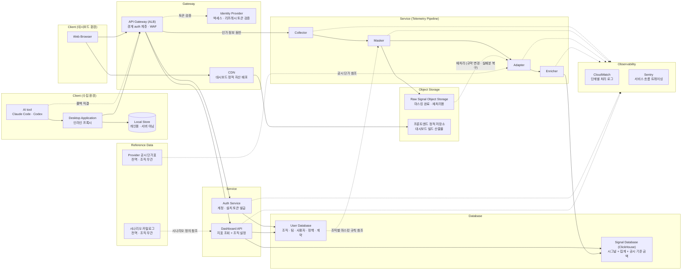

# Pulsemetry System Architecture

| 항목 | 내용 |
| --- | --- |
| 대상 범위 | Pulsemetry MVP — 웹 대시보드 + Claude Code · Codex CLI 수집 |
| 상태 | 컴포넌트 · 연결 구조 확정. 잔여 미확정은 §7 |

---

## 0. 이 문서의 사용 규칙

개발 중 구조에 대한 질문이 생기면 여기부터 본다. 다음 4가지를 지킬 때만 기준 문서로 기능한다.

1. **구조 질문은 이 문서가 먼저다.** 슬랙 대화, 회의 기억, 개인 메모보다 이 문서가 우선한다.
2. **문서와 코드가 다르면 둘 중 하나가 틀린 것이다.** 발견 즉시 이 문서를 고치거나 코드를 고친다.
   "일단 코드대로 가고 나중에 문서화"는 금지.
3. **정의되지 않은 컴포넌트·연결을 임의로 추가하지 않는다.** 필요하면 §7에 항목으로 올리고, 이 문서를
   먼저 고친 뒤 구현한다.
4. **사실과 추론을 구분한다.** §1~§4는 확정된 구조, §5는 구조에서 도출한 규칙(합의 대상), §7은 아직
   정해지지 않은 것이다.
5. **최종 형태만 적는다.** 이 문서는 사용자에게 제공될 완성된 아키텍처를 서술한다. 개발 환경의
   임시 구성, 아직 배선되지 않은 것, "향후 도입 예정" 같은 유보된 결정은 적지 않는다.

---

## 1. 아키텍처 한눈에 보기



9개 논리 영역 / 21개 컴포넌트로 구성된다.

| 영역 | 포함 컴포넌트 | 영역의 역할 |
| --- | --- | --- |
| Client (수집 환경) | AI tool, Desktop Application, Local Store | 개발자 로컬 머신. 시그널이 발생하고 1차 가공·전달되는 곳 |
| Client (대시보드 환경) | Web Browser | 관리자가 데이터를 소비하는 곳 |
| Gateway | API Gateway (ALB), Identity Provider, CDN | 외부 → 내부의 유일한 진입점과 정적 자산 배포 |
| Service | Auth Service, Dashboard API | 요청-응답형(동기) 서비스 |
| Service (Telemetry Pipeline) | Collector, Masker, Adapter, Enricher | 수집 데이터의 단방향 처리 파이프라인 |
| Database | User Database, Signal Database (ClickHouse) | 조회용 정형 데이터 |
| Object Storage | Raw Signal Object Storage, 프론트엔드 정적 저장소 | 마스킹 완료 시그널 적재(재처리용)와 대시보드 빌드 산출물 |
| Reference Data | Provider 공시 단가표, 시나리오 카탈로그 | 전역 참조 데이터. 조직에 종속되지 않는다. 단가표는 Adapter가, 시나리오 카탈로그는 Dashboard API가 읽는다 |
| Observability | CloudWatch, Sentry | 파이프라인·서비스의 처리 로그와 트레이싱. 데이터 평면이 아니다 |

Local Store는 서버 구성요소가 아니다. 사용자 기기의 저장소이며, 개인 대시보드와 서버로의 배치 전달을
위해 존재한다. 조직 관리자가 보는 데이터베이스에는 포함되지 않는다.

인증은 두 자리로 나뉜다. 요청마다 토큰이 유효한지 보는 것은 경계다 — API Gateway가 Identity
Provider에 위임해 액세스 토큰과 리프레시 토큰을 검증한다. 계정을 만들고 초대 코드로 설치
인스턴스에 토큰을 발급하는 것은 Auth Service다. 그래서 Auth Service는 모든 요청이 지나는
미들웨어가 아니라 Dashboard API와 같은 레이어의 서비스이며, 데스크탑을 상대하는 서버다.

토큰이 유효하다는 것과 그 주체가 이 자원에 접근해도 된다는 것은 다르다. 후자는 각 서비스의
security layer가 판정한다. 경계는 인증까지만 책임진다.

Web Browser는 두 경로를 쓴다. 대시보드 화면 자체는 CDN이 프론트엔드 정적 저장소의 빌드
산출물을 내려주고, 데이터 요청만 API Gateway로 간다.

Provider 공시 단가표는 조직 계약이 아니다. 벤더가 공표한 토큰당 단가이며 조직마다 다르지 않다.
조직별 계약 단가는 User Database에 있고 조회 시에만 쓰인다(§3 흐름 B). 두 값을 섞지 않는다.

시나리오 카탈로그는 관리자가 고를 수 있는 질문과 그 질문에 필요한 지표 · 화면 · 필터를 정의한 목록이며,
카탈로그가 참조할 수 있는 지표 ID의 목록인 지표 레지스트리를 함께 갖는다. 조직에 종속되지 않는 제품
자산이므로 전역 참조 데이터에 둔다. 시나리오가 조직에서 답할 수 있는 상태인지(가용성)는 여기 저장되지
않고, Dashboard API가 User Database의 정책 · 조직 상태를 대조해 조회 시 판정한다(§3 흐름 E).

Observability는 데이터 평면 밖이다. 시그널이 흐르는 경로가 아니라 각 컴포넌트가 자기 처리 상태를
내보내는 경로다. 여기 남는 것은 운영 로그이지 감사 로그가 아니다 — 감사 로그는 저장 대상·저장소가
정해지지 않아 이번 범위에서 제외돼 있다.

경계 auth 계층은 로드밸런서에서 종결한다. 애플리케이션 서버 안에도, 별도 auth 서버에도 두지
않는다.

---

## 2. 컴포넌트 카탈로그

| 컴포넌트 | 영역 | 역할 | 입력 (from) | 출력 (to) |
| --- | --- | --- | --- | --- |
| **AI tool** | Client (수집) | 시그널 발생원. MVP 기준 Claude Code CLI · Codex CLI | — | Desktop Application (폴백 시 API Gateway) |
| **Desktop Application** | Client (수집) | 인라인 프록시. loopback OTLP 수신 → 로컬 집계·저장 → 회사로 전달. 프라이버시 1차 집행 지점 | AI tool | API Gateway, Local Store |
| **Local Store** | Client (수집) | 사용자 기기의 로컬 저장소. 개인 대시보드 · 배치 전달용 | Desktop Application | (데몬 GUI, 향후) |
| **Web Browser** | Client (대시보드) | 웹 대시보드 클라이언트 | — | API Gateway |
| **API Gateway** | Gateway | 모든 외부 요청의 단일 진입점 겸 경계 auth 계층. 토큰 검증(Identity Provider에 위임) · WAF · rate limit · 요청 크기 제한 | AI tool, Desktop Application, Web Browser | Identity Provider, Auth Service, Dashboard API, Collector |
| **Identity Provider** | Gateway | 액세스 토큰 · 리프레시 토큰 검증. 서명 · 발급자 · 만료를 본다 | API Gateway | (검증 결과 반환) |
| **CDN** | Gateway | 대시보드 정적 자산 배포 | Web Browser | 프론트엔드 정적 저장소 |
| **Auth Service** | Service | 계정 관리와 초대 코드 기반 설치 인스턴스 토큰 발급. 데스크탑을 상대하는 서버이며 정책 Manifest도 여기서 내려간다 | API Gateway | User Database |
| **Dashboard API** | Service | 지표 조회 + 조직 설정 쓰기(조직 구성 · 계약 · 정책 · 구성원). 조회 시 조직 계약 단가를 적용해 2차 가공. 시나리오 카탈로그 조회와 조직 상태 기준 가용성 판정 | API Gateway, 시나리오 카탈로그 | Signal Database, User Database |
| **Collector** | Pipeline | 파이프라인 진입점. 시그널 수신·수용 (선별하지 않음) | API Gateway | Masker |
| **Masker** | Pipeline | 민감정보 마스킹 2차 집행. 조직별 마스킹 규칙을 User Database에서 읽어 적용. 파이프라인 최초 영속화 지점 | Collector, User Database | Adapter, Raw Signal Object Storage |
| **Adapter** | Pipeline | 벤더/도구별 OTel 형식 → 내부 공통 스키마 변환 · provider별 확장 스키마 정의 · 공시 단가 기준 금액 환산 | Masker, Raw Signal Object Storage(재처리), Provider 공시 단가표 | Enricher |
| **Enricher** | Pipeline | 조직·팀·사용자 결합, 시간 단위 집계 요약 후 최종 적재 (1차 가공까지). *(향후) 외부 연동 결과 매핑 확장 지점* | Adapter | Signal Database |
| **User Database** | Database | 조직 · 팀 · 사용자 · 권한 · 정책 · 조직별 AI Provider 계약 단가 | Auth Service, Dashboard API | Masker (정책 참조) |
| **Signal Database** | Database | ClickHouse. 정규화·보강 완료된 조회용 시그널 · 시간 단위 집계 · 공시 단가 기준 금액과 단가 버전 | Enricher, Dashboard API | — |
| **Raw Signal Object Storage** | Object Storage | 마스킹 완료 시그널 적재. 규약 변경 재변환과 변환 실패분 복구의 재처리 원천 | Masker | Adapter (재처리 시) |
| **프론트엔드 정적 저장소** | Object Storage | 대시보드 빌드 산출물 | (배포 시 갱신) | CDN |
| **Provider 공시 단가표** | Reference Data | 벤더 공표 토큰당 단가. 전역 · 조직 무관. 단가 버전을 갖는다 | (운영 갱신) | Adapter |
| **시나리오 카탈로그** | Reference Data | 사전 정의 시나리오와 지표 레지스트리. 전역 · 조직 무관. 가용성은 담지 않는다 | (배포 시 고정) | Dashboard API |
| **CloudWatch** | Observability | 파이프라인 4단계 · Auth · Dashboard API의 작업 전후 처리 로그 수집 | 전 서비스 | (운영 조회) |
| **Sentry** | Observability | 서비스 흐름 트레이싱 · 에러 추적 | 전 서비스 | (운영 조회) |

**가공은 두 단계이며, 비용은 이원화돼 있다.**

| 단계 | 하는 일 | 수행 시점 · 주체 |
| --- | --- | --- |
| 1차 가공 | 정규화 · 널 처리 · 분/시간 집계 · Provider별 분류 · 공시 단가 기준 금액 환산 | 적재 전, Adapter · Enricher |
| 2차 가공 | 조직 계약 단가 적용 | 조회 시, Dashboard API |

Adapter가 계산해 저장하는 것은 벤더 공시 단가 기준의 금액이다. 조직마다 다르지 않으므로 미리 계산해도
안전하고, ClickHouse에서 그대로 집계할 수 있다. 조직이 실제로 부담하는 금액은 계약 단가에 종속되므로
조회 시 Dashboard API가 계산한다 — 계약이 바뀌어도 재적재가 필요 없다. 공시 단가 자체가 바뀌면 그때는
재처리로 소급 정정한다(§3 흐름 D). 그래서 금액과 함께 단가 버전을 저장한다.

파이프라인에서 조직별 데이터를 읽는 것은 Masker뿐이다. Adapter가 참조하는 공시 단가표는 전역
참조 데이터이고, Enricher가 하는 결합은 이미 넘어온 인가 정보를 기준으로 한다.

집계·비용 전용 저장소는 없다. 집계와 공시 기준 금액 모두 Signal Database 안에 있다.

---

## 3. 데이터 흐름

### 흐름 A — 텔레메트리 수집 (쓰기 경로)

```
AI tool → Desktop Application → API Gateway → Collector → Masker → Adapter → Enricher → Signal Database
              └→ Local Store                              └──────────────→ Raw Signal Object Storage
```

- AI tool → Desktop Application은 push다. 벤더의 OTel exporter가 데몬의 loopback 수신기로 보낸다.
  로컬 로그 파일을 감시하는 pull 방식이 아니다.
- 데몬은 받은 배치를 두 갈래로 나눈다: ① 원본 바이트 → 상위 전달(프라이버시 1차 집행) ② 정규화 결과
  → Local Store(개인용).
- 파이프라인은 단방향 4단계이며 정상 흐름에 되돌아오는 경로가 없다.
- Masker에서 경로가 둘로 갈라진다: ① 마스킹 완료 시그널 보존(Object Storage) ② 가공 계속(Adapter).
- 이 분기가 raw-first 원칙("raw 정확 수집 → 표시 → 인사이트")을 구조로 구현한 지점이다. 다만 여기서
  "raw"는 마스킹 전 원본이 아니라 가공 전 시그널을 뜻한다.
- Adapter 이후에서 변환이 실패하면 그 시그널은 Signal Database에 적재되지 않고 Object Storage에만
  남는다. 이것이 흐름 D(재처리)의 복구 원천이다. 별도 DLQ에 의존하는 구조가 아니다.
- 각 단계는 작업 전후 상태를 CloudWatch에 로깅하고 Sentry로 트레이싱한다(I-12). 이 로그가 없으면
  "무엇이 실패했는지"를 특정할 수 없어 흐름 D의 대상 선택이 불가능해진다.

프롬프트는 정책에 따라 이 경로를 탄다. 조직의 Privacy 정책이 프롬프트 수집을 켜면 프롬프트가 서버로
전송되고, 서버 Masker가 관리자가 커스터마이징한 규칙으로 민감정보를 가린다. 정책이 꺼져 있으면
데몬이 전송 전에 제거하므로 서버에 도달하지 않는다.

Masker가 어느 조직의 규칙을 적용할지는 함께 넘어온 인가 정보로 정한다. `user_id`로 그 사원이 속한
조직을 User Database에서 찾고, 그 조직의 마스킹 규칙을 읽어 적용한다. 규칙이 조직마다 다르므로
이 조회 없이는 마스킹이 성립하지 않는다.

### 흐름 B — 대시보드 조회 (읽기 경로)

```
Web Browser → API Gateway → Dashboard API → Signal Database
                                          → User Database
```

- Dashboard API는 Signal Database와 User Database 두 곳을 조합해 응답한다. 사용량 수치(Signal)와
  조직 구조(User)를 조인해야 "부서별·팀별 비용"이 나오기 때문이다.
- 조직이 부담하는 금액은 이 시점에 계산된다 — Signal Database의 토큰 집계에 User Database의 조직 계약
  단가를 곱한다(2차 가공).
- Signal Database에 이미 들어 있는 공시 단가 기준 금액은 계약을 아직 입력하지 않은 조직의 기본값,
  그리고 계약 대비 기준선 비교에 쓴다. 두 값은 이름이 다르며 화면에서 섞이지 않는다.

### 흐름 C — 인증

```
검증   Client → API Gateway → Identity Provider
발급   Client → API Gateway → Auth Service → User Database
```

경로가 둘이다. 들어오는 요청의 토큰을 검증하는 것과, 토큰을 처음 발급하는 것은 다른 일이다.

- **검증**은 경계에서 끝난다. API Gateway가 Identity Provider에 위임해 액세스 토큰의 서명 · 발급자 ·
  만료를 확인하고, 통과한 요청만 내부로 넘긴다. 만료된 액세스 토큰은 리프레시 토큰으로 갱신한다.
- **발급**은 Auth Service가 한다. 계정을 만들고, 초대 코드를 검증해 설치 인스턴스에 토큰을 내준다.
  Identity Provider는 발급 절차에 관여하지 않는다.
- 설치 인스턴스 인증: 초대 코드 → Auth Service가 `installation_token`과 `telemetry_token`을 발급 →
  전자는 OS 키링에만, 후자는 도구 설정과 데몬 메모리에 둔다. 만료 시 설치 토큰으로 재발급받는다.
- 주체가 다르다 — 웹은 사람(관리자) 계정이고, 데스크탑은 설치 인스턴스(installation)다.
- 인가는 인증과 별개다. 토큰이 유효하다고 해서 그 자원에 접근해도 되는 것은 아니며, 이 판정은 각
  서비스의 security layer가 한다. 경계는 인증까지만 책임진다.
- 인증에 쓰인 토큰은 파이프라인으로 흘러가지 않는다. 검증으로 얻은 인가 정보
  (`org_id` · `installation_id` · `user_id`)만 하위로 전달되며, 토큰 자체는 어떤 저장소에도
  남지 않는다(I-11).

### 흐름 D — 재처리 (복구)

```
Raw Signal Object Storage → Adapter → Enricher → Signal Database (ClickHouse)
```

정상 흐름이 아니라 운영 개입 경로다. 트리거는 둘뿐이다.

| # | 트리거 | 하는 일 |
| --- | --- | --- |
| 1 | AI Provider의 OTel 규약 변경 | Adapter의 변환 규칙을 패치한 뒤, 이미 흘러간 데이터를 새 규칙으로 다시 변환해 소급 정정 |
| 2 | 변환 실패로 미적재 | 규칙이 깨져 Signal Database에 들어가지 못한 시그널을 Object Storage에서 꺼내 Adapter 로직부터 다시 태움 |

- 시작점은 항상 Adapter다. Object Storage의 데이터는 이미 마스킹을 마친 상태이므로 Masker를 다시
  태우지 않는다(I-9).
- 대상 선택은 raw 오브젝트의 메타데이터로 한다(§4). 시간 범위 · provider · 스키마 버전으로 좁힌다.
- 실행 주체는 내부 운영 도구(배치 · CLI)다. 관리자 대시보드에 재처리 화면·API를 두지 않는다(I-8).
- 재처리는 멱등해야 한다 — 같은 배치를 두 번 흘려도 집계가 중복되지 않아야 한다(I-10).
- 공시 단가가 개정된 경우에도 같은 경로로 소급 정정한다(§2).

### 흐름 E — 시나리오 적용

```
Web Browser → API Gateway → Dashboard API → 시나리오 카탈로그 (정의)
                                          → User Database (정책 · 조직 상태 → 가용성 판정)
```

관리자가 답하고 싶은 질문을 고르면 그 질문에 맞는 화면과 지표 구성이 적용되는 경로다.

- 카탈로그는 정의만 준다. 질문 · 필요 지표 · 대상 화면과 필터 · 측정 한계 단서 · 선행 조건이다.
- 가용성은 카탈로그에 없다. Dashboard API가 카탈로그의 선행 조건을 User Database의 정책 설정 · 조직
  구성 · 구성원 상태와 대조해 조회 시 판정한다(I-14). 같은 시나리오가 조직마다 다르게 보인다.
- 적용 결과는 화면 · 기간 · 팀 · 분해 축 · 강조 위젯으로 이루어진 프리셋이다. 지표 값 자체는 흐름 B가
  그대로 가져온다.
- 이 흐름은 Signal Database를 읽지 않는다. 시나리오는 새 지표를 만들지 않고 이미 있는 지표를 질문
  단위로 묶을 뿐이다(I-13).

### 흐름 F — 정책 Manifest 배포

```
쓰기   Web Browser → API Gateway → Dashboard API → User Database
읽기   Desktop Application → API Gateway → Auth Service → User Database
       Masker → User Database
```

관리자가 정한 수집·마스킹 정책이 집행 지점 두 곳에 도달하는 경로다.

- 관리자가 대시보드 설정에서 Privacy와 마스킹 규칙을 커스터마이즈하면 Dashboard API가 User
  Database에 쓴다. 정책의 소유자는 여기 하나다.
- 데스크탑 갈래 — 설치 인스턴스가 Auth Service에서 자기 조직의 Manifest를 내려받아 전송 전 1차
  집행에 쓴다.
- 서버 갈래 — Masker가 User Database를 직접 읽어 2차 집행에 쓴다(흐름 A).
- 두 갈래가 같은 원본을 보므로 규칙이 갈라지지 않는다. 다만 반영 시점은 다르다 — 서버는 즉시,
  데스크탑은 Manifest를 다시 받은 뒤다.

### 폴백 경로 — AI tool → API Gateway 직접 전송

AI tool이 Desktop Application을 거치지 않고 API Gateway로 직접 향하는 경로는 폴백이다. 발동 조건은
셋뿐이다 — ① 클라이언트가 로컬 수신기 토큰을 확보하지 못함, ② 조직 manifest의 프로토콜이 데몬이
전달할 수 없는 형식, ③ 사용자가 로컬 파이프라인을 명시적으로 해제.

두 경로는 병행이 아니라 설치 단위 택일이므로 중복 수집이 발생하지 않는다. 벤더의 OTel exporter가
시그널당 endpoint를 하나만 받기 때문에 구조적으로 이중 전송이 불가능하다.

---

## 4. 저장소 3종의 역할 분리

| 저장소 | 담는 것 | 쓰는 주체 | 읽는 주체 |
| --- | --- | --- | --- |
| **User Database** | 조직 · 팀 · 사용자 · 권한 · 정책 · 조직별 AI Provider 계약 단가 | Auth Service(계정 · 토큰), Dashboard API(조직 설정) | Auth Service, Dashboard API, Masker(정책) |
| **Raw Signal Object Storage** | 마스킹 완료 시그널 + 재처리용 메타데이터 | Masker | 재처리 배치 (트리거 2종, §3 흐름 D) |
| **Signal Database (ClickHouse)** | 정규화·보강된 조회용 시그널 + 시간 단위 집계 + 공시 단가 기준 금액 | Enricher | Dashboard API |

네 가지를 짚어둔다.

- Raw Signal Object Storage의 읽기 목적은 재처리 둘뿐이다 — ① AI Provider가 OTel 규약을 바꿨을 때
  이미 흘러간 데이터를 우리 스키마로 다시 맞추는 소급 재변환, ② 변환이 깨져 Signal Database에 적재되지
  못한 시그널의 복구다. 어느 쪽도 사람이 원본을 열람하는 경로가 아니다. 사용자에게 원본을 보여주는
  조회 기능은 제공하지 않으며, 재처리는 내부 운영 도구로만 트리거한다. 대시보드에 원본 조회 화면·API가
  없는 이유다.
- Signal Database에 쓰는 주체는 Enricher 하나뿐이다. 다른 컴포넌트가 직접 쓰기 시작하면 데이터
  일관성이 즉시 깨진다. 집계와 공시 기준 금액도 여기 함께 들어간다 — 별도의 집계·비용 저장소를 두지
  않는다.
- User Database에는 쓰는 주체가 둘이다. Auth Service가 계정·토큰을, Dashboard API가 조직 설정(조직
  구성 · 계약 · 정책 · 구성원)을 쓴다. 서로 다루는 영역이 겹치지 않는다. 읽기는 셋이며, Masker가
  조직별 마스킹 규칙만 읽는다 — 파이프라인에서 이 저장소를 보는 것은 Masker뿐이다.
- 어떤 저장소에도 자격증명 원문을 쓰지 않는다(I-11). 아래 raw 메타데이터의 테넌트 식별은 토큰 원문이나
  해시가 아니라 검증으로 얻은 인가 정보로 한다.

### raw 오브젝트 메타데이터

재처리 대상을 골라내려면 오브젝트마다 아래가 함께 저장돼야 한다. 이것이 없으면 §3 흐름 D의 "실패분만
골라 복구"가 성립하지 않는다.

| 항목 | 용도 |
| --- | --- |
| 배치 ID | 재처리 단위 · 멱등 키의 기반 |
| 수신 시각 | 시간 범위로 재처리 대상 좁히기 |
| `org_id` · `installation_id` · `user_id` | 토큰 검증으로 얻은 인가 정보. 테넌트 귀속 |
| provider | 규약이 바뀐 provider만 골라 재처리 |
| 마스킹 정책 버전 | 어떤 규칙으로 가려졌는지 추적 |
| 스키마 버전 | 어느 변환 규칙까지 적용됐는지 |

세부 필드 정의와 실패 시그널을 어떻게 표시할지(실패 마커 · 오프셋 · 배치 키)는 아직 미정이다(§7 Q15).

---

## 5. 아키텍처 불변식 (구조에서 도출한 규칙)

컴포넌트 연결 구조가 함의하는 규칙이다. 개발 중 무심코 어기기 쉬운 것들만 뽑았다. 이견이 있으면 §7에
올리고 이 문서를 고친 뒤 구현한다.

| # | 규칙 | 어겼을 때 생기는 일 |
| --- | --- | --- |
| I-1 | 외부 트래픽은 API Gateway(경계 auth 계층)를 통과한다. 클라이언트가 Collector·Dashboard API를 직접 호출하는 경로는 없다 | 인증 우회, 테넌트 위조, 감사 로그 누락 |
| I-2 | Masker를 거치지 않은 데이터는 어떤 서버 저장소에도 쓰지 않는다 | 마스킹 전 PII가 영속화됨 (되돌릴 수 없음) |
| I-3 | 파이프라인 4단계를 건너뛰지 않는다 (Collector → Masker → Adapter → Enricher) | 스키마 미변환 데이터가 Signal DB에 유입 |
| I-4 | Signal Database 쓰기는 Enricher만 수행한다 | 보강 안 된 레코드 혼입, 집계 신뢰도 붕괴 |
| I-5 | Dashboard API는 지표를 읽고 조직 설정을 쓴다. 파이프라인과 Signal Database에는 쓰지 않는다 | 읽기 경로와 수집 경로의 책임 분리 붕괴 |
| I-6 | User Database 쓰기 주체는 둘뿐이다 — 계정·토큰은 Auth Service, 조직 설정은 Dashboard API | 권한 데이터 정합성 깨짐 |
| I-7 | 클라이언트 마스킹을 신뢰해 서버 Masker를 생략하지 않는다 | 사용자 기기에서 도는 코드가 유일한 방어선이 됨 |
| I-8 | Raw Signal Object Storage에 사용자 조회 경로를 열지 않는다. 재처리는 내부 운영 도구로만 트리거한다 | 재처리용 저장소가 사실상 원본 열람 창구가 됨 |
| I-9 | 재처리는 Adapter부터 시작한다. 이미 마스킹된 데이터를 Masker에 다시 태우지 않는다 | 마스킹 재적용으로 데이터가 이중 훼손되거나, 원본 복원 경로로 오해됨 |
| I-10 | 재처리는 멱등해야 한다. 같은 배치를 다시 흘려도 집계가 중복되지 않는다 | 복구할수록 비용·사용량이 부풀어 지표를 못 믿게 됨 |
| I-11 | 자격증명(토큰 원문·해시)은 어떤 서버 저장소에도 쓰지 않는다. 테넌트 귀속은 검증으로 얻은 인가 정보(`org_id` · `installation_id` · `user_id`)로 한다 | 오브젝트 스토리지 유출이 곧 자격증명 유출이 됨 |
| I-12 | 파이프라인 각 단계는 작업 전후 상태를 로깅한다 (CloudWatch) | 실패한 시그널을 특정할 수 없어 흐름 D의 복구 대상을 고를 수 없음 |
| I-13 | 시나리오는 새 지표를 만들지 않는다. 카탈로그가 참조하는 지표는 지표 레지스트리에 정의돼 Signal Database에 이미 존재하는 것뿐이다 | 화면에만 있고 수집 근거가 없는 지표가 생김 |
| I-14 | 시나리오 가용성은 저장하지 않고 조회 시 판정한다 | 정책을 바꿔도 가용성이 따라오지 않아, 답할 수 없는 시나리오가 답할 수 있는 것처럼 보임 |

I-2의 "서버 저장소"는 문자 그대로다. 클라이언트 Local Store에는 정책상 회사로 전송하지 않기로 한 개인
데이터가 남으며, 그것은 이 불변식의 대상이 아니다(사용자 본인의 기기에 본인 데이터를 두는 일이다).

마스킹은 두 지점에서 집행한다 — 클라이언트 데몬이 전송 전 1차, 서버 Masker가 2차다(I-7). 규칙이 두
곳에서 관리되는 비용을 감수하는 이유는 클라이언트를 완전히 신뢰할 수 없기 때문이다.

I-9 · I-10 · I-12는 서로 맞물린다. 로깅(I-12)이 복구 대상을 특정하게 하고, 재처리 시작점(I-9)이
마스킹 재적용을 막고, 멱등성(I-10)이 복구가 지표를 망치지 않게 한다. 셋 중 하나가 빠지면 §3 흐름 D가
안전한 운영 절차가 되지 못한다.

I-13은 I-5를 무너뜨리지 않는다. Dashboard API가 시나리오를 다뤄도 하는 일은 여전히 지표를 읽고 조직
설정을 쓰는 것뿐이며, 파이프라인과 Signal Database에 쓰지 않는다. 시나리오가 늘어난다고 수집 경로에
새 지표가 생기지 않는다.

---

## 6. MVP 스코프와의 정합성

| MVP 스코프 결정 | 아키텍처상 대응 | 정합 |
| --- | --- | --- |
| 제품 = 웹 대시보드 | 화면은 CDN이, 데이터는 Dashboard API가 준다 | ✅ |
| 데이터 원천 = Claude Code · Codex 두 CLI | Client(수집 환경)의 AI tool + Desktop Application | ✅ |
| raw-first (raw 정확 수집 → 표시 → 인사이트) | Masker → Raw Signal Object Storage로 마스킹 후 가공 전 시그널 보존 | ✅ |
| 먼저 수집 후 가공 (선별 X) | Collector는 수용만, 가공은 Adapter·Enricher | ✅ |
| MVP = 비용 통합·가시화(모니터링) | Adapter의 공시 기준 금액 + Dashboard API의 조직 계약 단가 적용 | ✅ |
| PII 탐지·마스킹 | MVP다. 클라이언트 1차 · 서버 Masker 2차로 이중 집행하며, 양쪽 다 조직이 정한 규칙을 쓴다 (§3 흐름 F) | ✅ |
| 대기업 Self-hosted / 중소 SaaS 이중 제공 | 배포 형태는 구조에 표현되지 않았다. CloudWatch · Sentry 종속이 사내망 배포와 충돌한다 | ⚠️ 미표현 + 관측성 대체 경로 필요 (§7 Q10) |
| 시나리오 엔진 (관리자가 질문으로 볼 지표를 고른다) | Reference Data의 시나리오 카탈로그 + Dashboard API의 가용성 판정 · 프리셋 반환 (§3 흐름 E) | ✅ |
| 어드바이스 엔진 / 인사이트 (확장 비전) | 대응 컴포넌트 없음 (의도된 제외) | ✅ |

시나리오 엔진은 어드바이스 엔진이 아니다. 지표를 해석하거나 조언을 만들지 않고, 이미 있는 지표 중
무엇을 볼지 고르게 하는 내비게이션 보조다. 마지막 행이 여전히 "대응 컴포넌트 없음"인 이유이며, 두
기능을 같은 것으로 취급하지 않는다.

---

## 7. 미확정 사항 (TBD)

| # | 질문 | 막히는 작업 | 상태 |
| --- | --- | --- | --- |
| Q5 | Adapter의 변환 대상 스키마와 Enricher의 보강 항목 세부 필드 정의 | 파이프라인 전체 | 부분 확정 — 구조는 *공통 스키마 + provider별 확장 스키마*로 확정(§2). 필드는 미정 |
| Q6 | 파이프라인 단계 간 전달 방식: 동기 호출인가 큐/스트림인가 | 배포 구조 | 실패분 복구는 Object Storage가 원천이므로(§3 흐름 D) 큐 DLQ에 의존하지 않는다. 처리량·백프레셔 관점만 남음 |
| Q8 | 수집 트래픽과 대시보드 트래픽의 부하 분리 | Gateway 구성 | 부분 확정 — 같은 Gateway를 공유하고 경로로 분기한다(§1). 부하 특성이 갈릴 때 뒷단을 어떻게 나눌지는 미정 |
| Q10 | Self-hosted 배포 시 구성 차이 + 관측성 대체 경로 (사내망에서 CloudWatch · Sentry를 쓸 수 없다) | 배포 아키텍처 | 미정 |
| Q11 | 각 컴포넌트의 기술 스택·런타임 | 전체 | 부분 확정 — Signal Database = ClickHouse, User Database = PostgreSQL, 경계 = ALB, 관측성 = CloudWatch · Sentry. 나머지 미정 |
| Q14 | Provider 공시 단가표의 소유·갱신 주체와 저장 위치 (코드 상수 · 설정 · DB 중 무엇인가, 단가 개정 시 소급 정정을 어떻게 발동하는가) | Adapter의 금액 환산 | 미정 |
| Q15 | 실패 시그널 식별 방식 — 실패 마커 · 배치 키 · 재처리 대상 선택 기준 | 흐름 D 복구 | 미정 |
| Q16 | LLM 자유 질의 확장 시 생성 시나리오의 저장 위치 — 사전 정의 카탈로그는 전역 참조 데이터인데 조직별 사용자 시나리오는 어디에 두는가 | 시나리오 엔진 확장 | 미정 |
| Q17 | LLM 생성 출력의 검증 방식 — 지표 레지스트리 범위 제한만으로 충분한가, 관리자 승인 단계를 두는가 | 시나리오 엔진 확장 | 미정 |

§7의 항목이 확정되면 해당 행을 지우고 본문(§2~§5)에 사실로 편입한다. 컴포넌트·연결이 추가·삭제되면
§1 다이어그램, §2 카탈로그, 부록 A를 모두 함께 고친다.

---

## 부록 A. 컴포넌트 · 연결 명세

§1 다이어그램의 노드와 엣지를 표로 옮긴 것이다.

### A-1. 노드 (21개)

| 컴포넌트 | 소속 영역 | 비고 |
| --- | --- | --- |
| AI tool | Client (수집 환경) | Claude Code · Codex |
| Desktop Application | Client (수집 환경) | 인라인 프록시 |
| Local Store | Client (수집 환경) | 개인용, 서버 저장소 아님 |
| Web Browser | Client (대시보드 환경) | — |
| API Gateway | Gateway | ALB. 경계 auth 계층 · WAF |
| Identity Provider | Gateway | 액세스 · 리프레시 토큰 검증 |
| CDN | Gateway | 대시보드 정적 자산 배포 |
| Auth Service | Service | 계정 · 설치 토큰 발급 · Manifest 배포 |
| Dashboard API | Service | 조직 설정 쓰기 + 조직 계약 단가 적용(2차 가공) |
| Collector | Service (Telemetry Pipeline) | — |
| Masker | Service (Telemetry Pipeline) | 마스킹 2차 집행 지점. 조직별 규칙 참조 |
| Adapter | Service (Telemetry Pipeline) | 재처리 입력 + provider별 확장 스키마 · 공시 단가 기준 금액 환산 |
| Enricher | Service (Telemetry Pipeline) | 1차 가공까지. *(향후) 외부 연동 확장 지점* |
| User Database | Database | 팀 · 정책 · 조직별 계약 단가 |
| Signal Database | Database | ClickHouse. 공시 기준 금액 포함 |
| Raw Signal Object Storage | Object Storage | 마스킹 완료 · 재처리용. 메타데이터 동반 |
| 프론트엔드 정적 저장소 | Object Storage | 대시보드 빌드 산출물 |
| Provider 공시 단가표 | Reference Data | 전역 참조 데이터 |
| 시나리오 카탈로그 | Reference Data | 전역 참조 데이터. 지표 레지스트리 포함 |
| CloudWatch | Observability | 단계별 처리 로그 |
| Sentry | Observability | 서비스 흐름 트레이싱 |

### A-2. 엣지 (번호 19개 + 참조 4개 + 관측성 6개)

| # | From | To | 비고 |
| --- | --- | --- | --- |
| 1 | AI tool | Desktop Application | 기본 경로 (push) |
| 2 | AI tool | API Gateway | 폴백 직결 (점선) |
| 3 | Desktop Application | API Gateway | OTLP 전달 |
| 4 | Desktop Application | Local Store | 로컬 집계·저장 |
| 5 | Web Browser | API Gateway | 데이터 요청 |
| 6 | Web Browser | CDN | 정적 자산 요청 |
| 7 | CDN | 프론트엔드 정적 저장소 | 오리진 |
| 8 | API Gateway | Identity Provider | 점선 — 토큰 검증 위임 |
| 9 | API Gateway | Auth Service | 계정 · 토큰 발급 요청 |
| 10 | API Gateway | Dashboard API | 검증 후 전달 |
| 11 | API Gateway | Collector | 검증 후 전달 (인가 정보 동반) |
| 12 | Auth Service | User Database | 계정 · 토큰 · Manifest 조회 |
| 13 | Dashboard API | User Database | 조직 설정 읽기·쓰기 + 계약 단가 읽기 |
| 14 | Dashboard API | Signal Database | 지표 · 공시 기준 금액 읽기 |
| 15 | Collector | Masker | |
| 16 | Masker | Adapter | |
| 17 | Masker | Raw Signal Object Storage | 마스킹 후 보관 (+ 메타데이터) |
| 18 | Adapter | Enricher | |
| 19 | Enricher | Signal Database | |
| (참) | User Database | Masker | 점선 — 조직별 마스킹 규칙 참조 |
| (참) | Raw Signal Object Storage | Adapter | 점선 — 재처리 (규약 변경 소급 · 실패분 복구) |
| (참) | Provider 공시 단가표 | Adapter | 점선 — 공시 단가 참조 |
| (참) | 시나리오 카탈로그 | Dashboard API | 점선 — 시나리오 정의 참조 |
| (관) | Collector · Masker · Adapter · Enricher · Auth Service · Dashboard API | Observability | 점선 6개 — 작업 전후 로그 · 트레이싱 |

API Gateway가 Auth Service · Dashboard API · Collector를 직접 호출한다(엣지 9~11). 인증은 경계에서
끝나므로 요청이 지나가는 인증 서비스가 따로 없다.
